# Astro + Claude-Code Website Assistant — Comprehensive Plan  
*Example implementation for **ameliastamps.com***  
*Updated: 2025-08-07*

---

## 1. Goals

| # | Goal | Success Metric |
|---|------|----------------|
| 1 | Let a user update content & theme through natural-language threads | < 10 s from request to preview refresh for simple edits |
| 2 | Support complex refactors with agentic plans & approvals | 100 % of risky changes gated behind user approval |
| 3 | Keep infra costs low while allowing instant previews | ≤ $60 / month base infra for 1 active client |
| 4 | Ship static, CDN-backed production sites | TTFB ≤ 100 ms global |

---

## 2. High-Level Architecture

```mermaid
flowchart TD
    subgraph User
        U1[Email / Chat] -->|instruction| GW[🚪 NestJS Gateway]
    end
    GW -->|router<br>SIMPLE| CCE[Claude-Code Execute]
    GW -->|router<br>COMPLEX| CCP[Claude-Code Plan]
    CCP -->|plan JSON| UI[Plan UI] --> U1
    UI -->|approve| CCE
    CCE -->|file edits| ASTRO[Astro Dev Server<br>HMR in Fargate]
    ASTRO -->|instant preview| Browser
    CCE -->|commit PR| GH[GitHub]
    GH --> CI[GitHub Actions] -->|Astro build| S3[S3 bucket]
    S3 --> CF[CloudFront] --> Browser
    classDef box fill:#f5f5f5,stroke:#333,stroke-width:1px;
    class CCE,CCP,CI,S3,CF,ASTRO box;
```



---

## 3. Domain & Routing Strategy

| Environment | Domain (example) | Origin | Notes |
|-------------|------------------|--------|-------|
| **Production** | `ameliastamps.com` | S3 (static) → CloudFront | Immutable assets, cache-bust by hash |
| **Live Edit** | `edit.ameliastamps.com` | ALB → Fargate (Astro dev) | Active during edit sessions, HMR enabled |
| **Staging** | `staging.ameliastamps.com` | S3 (static) → CloudFront | Latest build from feature branch |

**CloudFront Behaviors Configuration**  
* Single CloudFront distribution with multiple behaviors:
  * `/` → Default to S3 origin (production static files)
  * `/api/*` → ALB origin for NestJS edit commands
  * `/preview/*` → Fargate origin during active edit sessions (Astro dev server)
* Route 53 + ACM wildcard cert (`*.ameliastamps.com`)
* **No Lambda@Edge needed** - CloudFront behaviors handle routing natively
* Fargate container auto-scales to zero when idle (5 min timeout)

---

## 4. Branch & Thread Conventions

| Purpose | Git branch |
|---------|------------|
| Mainline | `main` |
| User thread | `feature/thread-<uuid>` |
| Release PR | `release/<date>` |

*Only one active thread per single-user site.*  
Merging `feature/thread-*` into `main` triggers **production** deploy.

---

## 5. AI Workflow Details

| Step | Action | Tooling |
|------|--------|---------|
| 1 | **Router** classifies (`SIMPLE`, `COMPLEX`, `ASK_CONTEXT`) | Cheap base LLM (e.g. Haiku-8k) |
| 2 | **SIMPLE** → direct `claude-code execute` | Direct file edits, HMR updates in 1-2s |
| 3 | **COMPLEX** → `claude-code plan` → user approval | Plan JSON rendered in UI |
| 4 | **Claude Code SDK** in Fargate container (4 GB RAM, 2 vCPU) | TypeScript SDK with streaming support |
| 5 | **Astro dev server** provides instant HMR updates | Port 4321 exposed via ALB, WebSocket support |

**Live Edit Architecture Details**
* Fargate task runs both Claude Code SDK and Astro dev server
* File changes from Claude Code immediately trigger Astro HMR
* WebSocket connection maintains live preview updates
* **EFS persistent storage** for user workspaces with shared dependencies
* **Git branch-based threading** for natural isolation and history
* Container remains warm for 5 minutes after last activity

**EFS Workspace Structure**
```
/workspace/
├── {clientId}/
│   └── {userId}/           # User workspace (persistent)
│       ├── project/        # Single git repo (all branches)
│       │   ├── .git/       # All thread branches here
│       │   ├── node_modules/ # Shared across threads (90% storage saved)
│       │   └── .astro/     # Shared build cache
│       ├── .claude/        # Claude state
│       │   ├── threads/    # Individual thread contexts
│       │   └── user.json   # User preferences
│       └── metadata.json   # Workspace metadata
```

---

## 6. Cost Model

### Single Client (Base Costs)
| Component | Monthly $ | Notes |
|-----------|-----------|-------|
| Route 53 hosted zone | 0.50 | Per domain |
| ACM wildcard cert | 0 | Free |
| **ALB** (1 LCU) | 18-20 | Shared across clients |
| Fargate (4GB/2vCPU @ 10hrs/mo) | ~8 | Auto-scales to zero |
| **EFS Standard** (5GB active) | 1.50 | User workspace + cache |
| **EFS IA** (15GB archived) | 0.38 | Old threads after 30 days |
| CloudFront | 3 | 100GB transfer |
| S3 storage (10GB) | 0.25 | Static sites |
| Claude API | 15-30 | ~1000 requests/mo |
| **Total** | **$47-63** | First client |

### Per Additional Client
| Component | Incremental $ | Notes |
|-----------|--------------|-------|
| Route 53 zone | +0.50 | Per domain |
| EFS storage | +0.75 | ~2.5GB per client workspace |
| S3 storage | +0.25 | ~10GB per site |
| Fargate compute | +4-8 | Depends on edit frequency |
| Claude API | +15-30 | Per client usage |
| **Per client** | **+$20-40** | Marginal cost |

### Batch Pricing (10+ clients)
* Shared ALB amortized: $2/client
* Reserved Fargate capacity: 30% discount
* EFS costs scale efficiently with lifecycle policies
* Claude API volume pricing: 20% discount
* **Effective per client: $25-35/mo**

### EFS Storage Benefits
* **90% storage reduction** vs per-thread repositories
* **Shared dependencies** eliminate redundant npm installs
* **Build cache sharing** across all user threads
* **Automatic lifecycle** moves old data to IA storage ($0.025/GB)

---

## 7. Example Flow for *ameliastamps.com*

1. **User** (scott@ameliastamps.com) emails:  
   > "Add a new gallery page 'Autumn Collection' with the 8 attached images."
2. Router → `SIMPLE`.  
3. NestJS spins up Fargate task with Claude Code + Astro dev server.
4. **ThreadManager** either:
   - **First time**: Clone repo to `/workspace/ameliastamps/scott/project/` + `npm install`
   - **Returning**: Switch to existing workspace, create/checkout `thread-B142` branch
5. Claude Code SDK executes file changes on `thread-B142` branch.
6. Astro dev server HMR updates preview at `edit.ameliastamps.com` in **1-2 seconds**.
7. User sees live preview, makes additional tweaks via chat (all on same branch).
8. **Auto-commit** each change to `thread-B142` with descriptive messages.
9. User confirms → **merge branch** to main → trigger production build.
10. GitHub Action builds from main → deploys to `ameliastamps.com`.
11. Thread branch preserved for history; Fargate idles after 5 minutes.

**Next session benefits**:
- **Instant startup** (no clone/install)
- **Build cache intact** (Astro builds in 2-5s instead of 30s)
- **Thread resume** from any previous conversation

---

## 8. Revised Sprint Plan Based on Existing Work

### **Current Assets to Leverage**
- ✅ AWS CDK infrastructure (Hephaestus) with S3, CloudFront, Lambda build pipeline
- ✅ SQS email ingestion from SES (Hermes)
- ✅ AWS Bedrock integration with Claude models
- ✅ Astro site structure with content collections
- ✅ Docker-based Lambda build system
- ⚠️ LangGraph state machine (replace with Claude Code SDK)
- ⚠️ Mock CMS tools (replace with real file operations + git branching)

### **Sprint 1 — Claude Code Migration (Week 1-2)**

| Day | Task | Status | Notes |
|-----|------|--------|-------|
| 0.5 | **ECR, Secrets Manager, EFS, ALB setup** | New | Prerequisites: persistent storage foundation |
| 1-2 | **Create Claude Code SDK Docker container with ThreadManager** | New | User/branch-based workspace model |
| 3-4 | **Deploy Fargate with EFS mounting** | New | Persistent user workspaces |
| 5-6 | **Replace LangGraph with Claude Code SDK** | Refactor | Git branch threading, simplified logic |
| 7-8 | **Convert mock CMS tools to real git operations** | Refactor | Branch-based file system access |
| 9 | **Add CloudFront behaviors for edit.ameliastamps.com** | Modify | Route to Fargate for live editing |
| 10 | **Integration testing with persistent workspaces** | Test | Verify EFS, branch switching, thread resume |

### **Sprint 2 — Live Preview & Production (Week 3-4)**

| Day | Task | Status | Notes |
|-----|------|--------|-------|
| 1-2 | Implement Astro dev server with HMR in Fargate | New | WebSocket support via ALB |
| 3-4 | Simplify Hermes to router + Claude Code executor | Refactor | Remove LangChain dependencies |
| 5-6 | Add GitHub branch management for threads | Enhance | Use existing git in Lambda |
| 7 | Connect existing Lambda build to staging deploys | Modify | Reuse Hephaestus function |
| 8 | Plan approval UI (simple email-based initially) | New | HTML email with approve/reject |
| 9 | Complete ameliastamps.com content migration | Content | Full site, not just stubs |
| 10 | End-to-end testing and production cutover | Deploy | Switch DNS to new system |

### **Post-MVP Optimization (Week 5)**
- Remove unused LangChain/LangGraph dependencies
- Optimize Fargate auto-scaling policies
- Add monitoring with existing CloudWatch setup
- Implement cost tracking per client
- Documentation and runbook creation

**Exit criteria:**  
* Email flow → Claude Code execution → live preview at `edit.ameliastamps.com` in < 2s
* **User workspace persistence**: Resume sessions with cached dependencies
* **Git branch isolation**: Each thread on separate branch with auto-commit
* **90% storage efficiency** vs per-thread repositories
* Reuse existing Lambda for production builds
* Total infrastructure cost: ~$47-63/month (including EFS)

---

## 9. Technical Migration Details

### From LangChain to Claude Code SDK
```typescript
// BEFORE (Hermes with LangGraph)
const plannerNode = async (state: SiteState) => {
  const response = await bedrockService.invokeModel({
    model: 'claude-3-opus',
    messages: [...],
    tools: cmsTools
  });
  return { plan: response.content };
};

// AFTER (Claude Code SDK)
import { ClaudeCode } from '@anthropic/claude-code-sdk';
const claude = new ClaudeCode({ apiKey: process.env.ANTHROPIC_API_KEY });

const handleEdit = async (instruction: string) => {
  const result = await claude.execute({
    instruction,
    mode: instruction.length > 100 ? 'plan' : 'execute',
    workingDirectory: '/workspace/amelia-astro',
    tools: ['file_edit', 'git_commit', 'astro_preview']
  });
  return result;
};
```

### Reusing Existing Infrastructure
```typescript
// Existing Hephaestus Lambda can be triggered for production builds
const triggerProductionBuild = async (branch: string) => {
  await sqs.sendMessage({
    QueueUrl: 'arn:aws:sqs:us-west-2:942734823970:AstroBuildQueue',
    MessageBody: JSON.stringify({
      ref: `refs/heads/${branch}`,
      repository: { name: 'amelia-astro' },
      environment: 'production'
    })
  });
};
```

### Fargate Task Definition for Live Edit
```yaml
TaskDefinition:
  cpu: 2048  # 2 vCPU
  memory: 4096  # 4 GB
  containers:
    - name: claude-code-astro
      image: claude-code-astro:latest
      ports:
        - 4321  # Astro dev server
        - 8080  # API endpoint
      environment:
        - ANTHROPIC_API_KEY
        - GITHUB_TOKEN
        - ASTRO_DEV_MODE=true
      mountPoints:
        - /workspace  # Persistent volume for edits
```

### Email Router Simplification
```typescript
// Simplified Hermes router (remove LangGraph complexity)
export class MessageRouter {
  async route(email: ParsedMail): Promise<'simple' | 'complex' | 'ask'> {
    // Use existing Bedrock service with Haiku for classification
    const classification = await this.bedrockService.classify(email.text);
    return classification;
  }
  
  async process(email: ParsedMail, mode: string) {
    if (mode === 'simple') {
      // Direct execution via Claude Code SDK
      return await this.claudeCode.execute({ instruction: email.text });
    } else {
      // Generate plan for approval
      return await this.claudeCode.plan({ instruction: email.text });
    }
  }
}

---

## 10. Future Enhancements

* Multi-tenant Fargate tasks for cost optimization
* Redis cache layer for frequently accessed content
* WebAssembly-based browser preview for instant updates
* Voice interface via Twilio for hands-free editing
* A/B testing framework with CloudFront behaviors

---

*Prepared on 2025-08-06*  
*Updated on 2025-08-07 with CloudFront behaviors, live edit architecture, multi-client cost model, and EFS persistent workspaces with git branch-based threading*