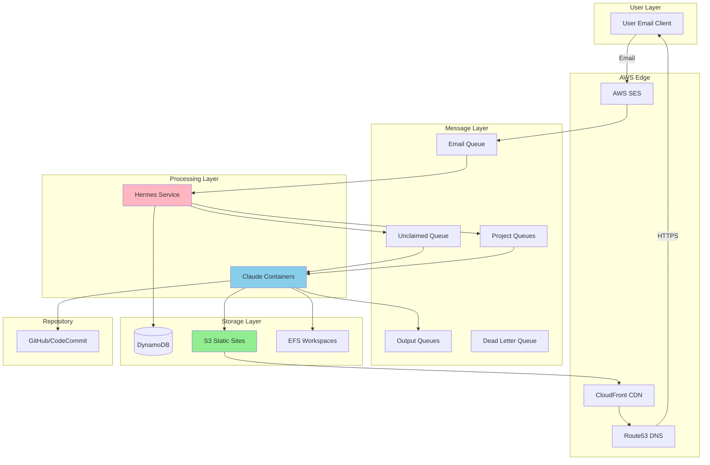
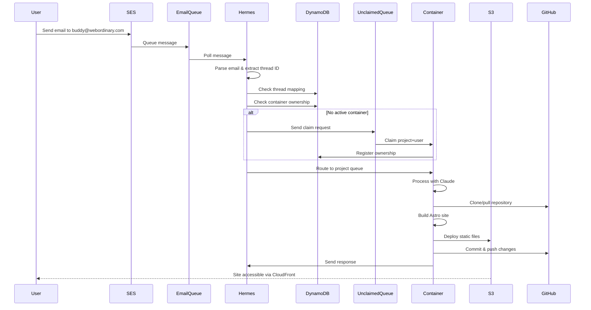
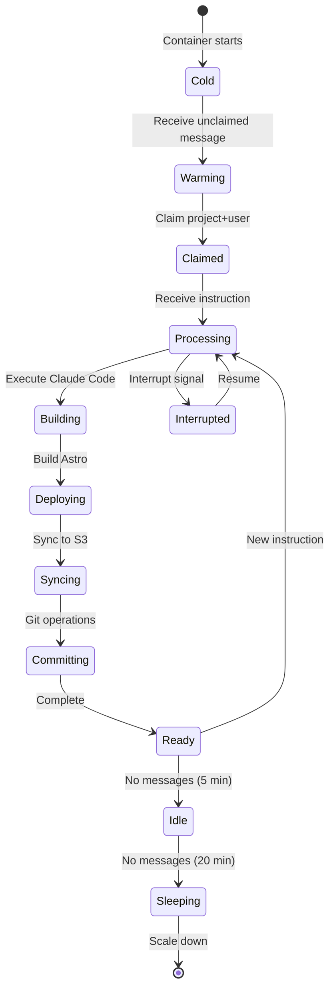
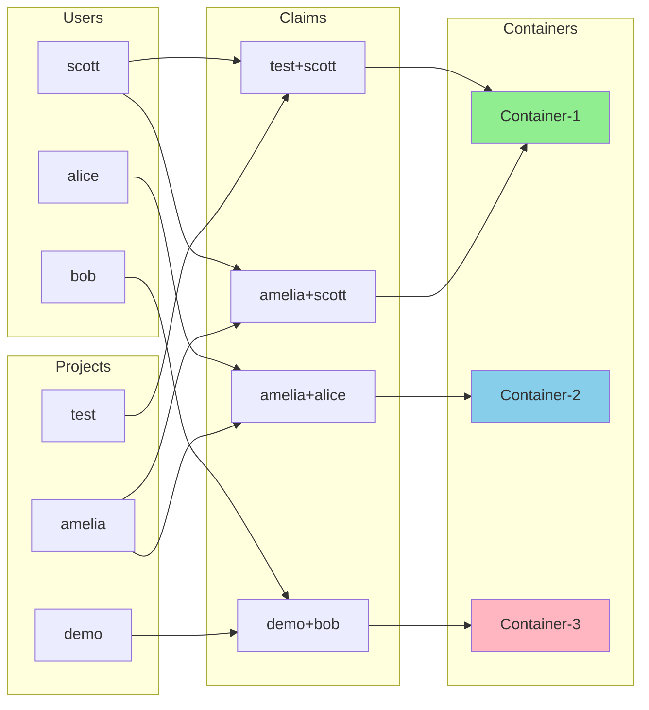
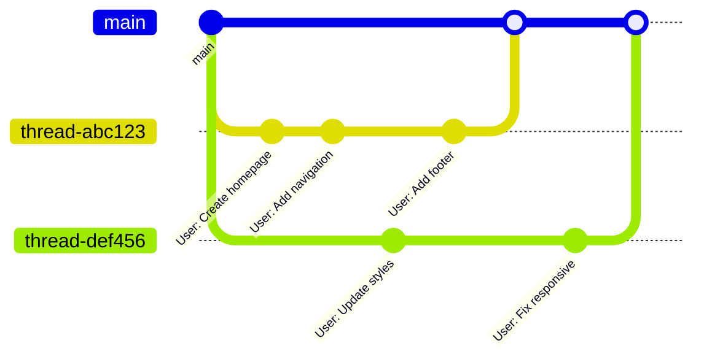
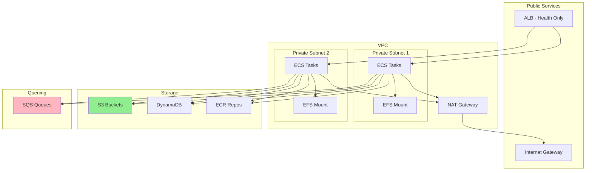
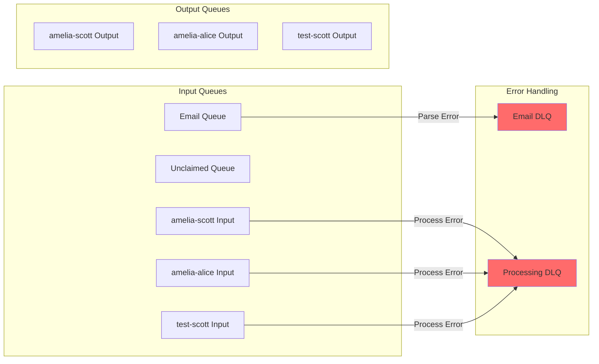
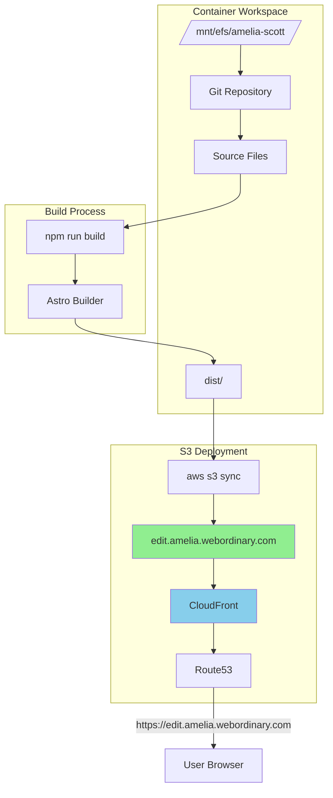
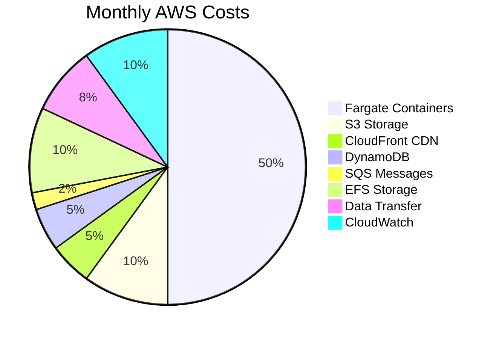
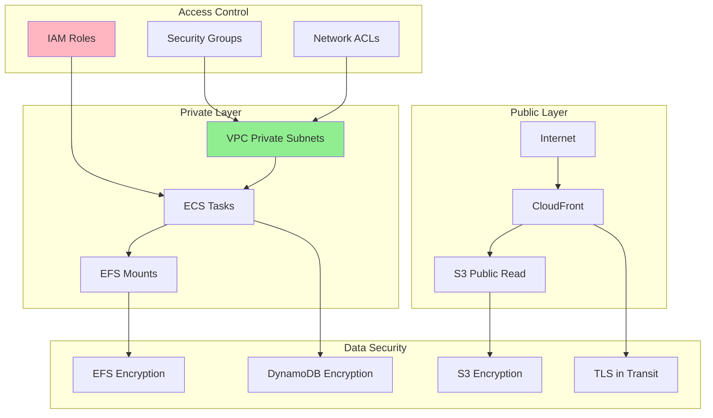

# WebOrdinary Architecture Diagrams

## System Overview - S3 Architecture (Current)

## Message Flow Detail

## Container Lifecycle

## Project+User Ownership Model

## Git Branch Strategy

## Infrastructure Stack

## Queue Architecture

## S3 Deployment Pattern

## Cost Optimization Strategy

## Security Model

---

These diagrams represent the current S3-based architecture. For implementation details, see the component READMEs.