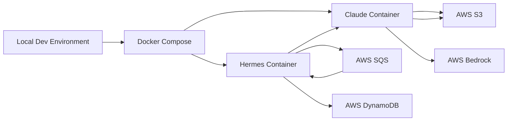

# Local Development Guide

## 🚀 Quick Start

```bash
# Start everything
./scripts/start-local-dev.sh

# Stop everything
./scripts/stop-local-dev.sh

# Clean stop (removes volumes)
./scripts/stop-local-dev.sh --clean
```

## 📋 Prerequisites

### Required Software
- [ ] **Docker Desktop** - [Download](https://www.docker.com/products/docker-desktop)
- [ ] **AWS CLI** - `brew install awscli`
- [ ] **jq** (optional, for JSON parsing) - `brew install jq`
- [ ] **Git** - Should already be installed

### AWS Setup
- [ ] AWS Account with programmatic access
- [ ] AWS CLI configured: `aws configure --profile personal`
- [ ] Bedrock access enabled (optional, for real Claude models)
- [ ] Access to WebOrdinary AWS resources (DynamoDB, SQS, S3)

### Environment Files
Both containers need `.env.local` files. Templates are provided:
```bash
cp hermes/.env.local.example hermes/.env.local
cp claude-code-container/.env.local.example claude-code-container/.env.local
```

**Important variables to set:**
- `AWS_PROFILE=personal`
- `AWS_ACCOUNT_ID=942734823970`
- `GITHUB_TOKEN` (for Git operations)

## 🏗️ Architecture



### Services
1. **Hermes** (Port 3000)
   - Message orchestration
   - SQS queue consumer
   - Container lifecycle management
   - Health endpoint: http://localhost:3000/hermes/health

2. **Claude Container** (No HTTP port)
   - Message processor
   - Astro site builder
   - S3 deployment
   - Runs in simulation mode by default

## 📚 Step-by-Step Setup

### 1. Clone Repository
```bash
git clone https://github.com/webordinary/webordinary.git
cd webordinary
```

### 2. Configure AWS
```bash
# Configure AWS CLI
aws configure --profile personal
# AWS Access Key ID: [your-key]
# AWS Secret Access Key: [your-secret]
# Default region: us-west-2
# Default output: json

# Verify access
aws sts get-caller-identity --profile personal
```

### 3. Setup Environment Files
```bash
# Copy templates
cp hermes/.env.local.example hermes/.env.local
cp claude-code-container/.env.local.example claude-code-container/.env.local

# Edit files and add your values
# Required: AWS_PROFILE, AWS_ACCOUNT_ID, GITHUB_TOKEN
```

### 4. Enable Bedrock (Optional)
```bash
# Verify Bedrock access
./claude-code-container/scripts/verify-bedrock.sh

# If not enabled, request access at:
# https://console.aws.amazon.com/bedrock/home#/modelaccess
```

### 5. Start Services
```bash
./scripts/start-local-dev.sh
```

This will:
- Check prerequisites
- Create missing .env.local files
- Build Docker images
- Start both services
- Wait for health checks
- Display service URLs

### 6. Verify Services
```bash
# Check Hermes health
curl http://localhost:3000/hermes/health

# Check running containers
docker compose -f docker-compose.local.yml ps

# View logs
docker compose -f docker-compose.local.yml logs -f
```

## 🧪 Testing Workflows

### Test 1: Basic Health Check
```bash
# Hermes API health
curl -s http://localhost:3000/hermes/health | jq .

# Container status
docker compose -f docker-compose.local.yml ps
```

### Test 2: SQS Message Processing
```bash
# Send test message to SQS
aws sqs send-message \
  --queue-url https://sqs.us-west-2.amazonaws.com/942734823970/webordinary-email-queue \
  --message-body '{"test": "message"}' \
  --profile personal

# Watch Hermes logs
docker compose -f docker-compose.local.yml logs -f hermes
```

### Test 3: End-to-End Flow
```bash
# 1. Start services
./scripts/start-local-dev.sh

# 2. Send email-like message
aws sqs send-message \
  --queue-url https://sqs.us-west-2.amazonaws.com/942734823970/webordinary-email-queue \
  --message-body '{
    "from": "test@example.com",
    "subject": "Test Message",
    "body": "Build and deploy the site"
  }' \
  --profile personal

# 3. Monitor processing
docker compose -f docker-compose.local.yml logs -f

# 4. Check S3 deployment
aws s3 ls s3://edit.amelia.webordinary.com/ --profile personal
```

## 🐛 Troubleshooting

### Common Issues

#### 1. "Cannot connect to Docker daemon"
```bash
# Ensure Docker Desktop is running
open -a Docker
```

#### 2. "AWS credentials not configured"
```bash
# Configure profile
aws configure --profile personal

# Verify
aws sts get-caller-identity --profile personal
```

#### 3. "Container exits immediately"
```bash
# Check logs
docker compose -f docker-compose.local.yml logs claude-container

# Common fixes:
# - Ensure .env.local exists
# - Check GITHUB_TOKEN is set
# - Verify AWS credentials
```

#### 4. "Port already in use"
```bash
# Find process using port 3000
lsof -i :3000

# Kill process
kill -9 <PID>
```

#### 5. "Bedrock model access denied"
```bash
# Request model access
# Go to: https://console.aws.amazon.com/bedrock/home#/modelaccess
# Enable: Claude Sonnet 4, Claude Haiku, Claude Opus

# Verify access
./claude-code-container/scripts/verify-bedrock.sh
```

#### 6. "SQS queue not found"
```bash
# Verify queue exists
aws sqs list-queues --profile personal | grep webordinary

# Check queue URL in .env.local matches actual queue
```

### Architecture-Specific Issues (M1/M2 Macs)

The local development setup builds containers for native architecture (ARM64 on Apple Silicon).
For production deployment to ECS (which requires AMD64), use:

```bash
# Production build (for ECS)
docker build --platform linux/amd64 -t webordinary/hermes ./hermes
docker build --platform linux/amd64 -t webordinary/claude-code-astro ./claude-code-container
```

### Debugging Commands

```bash
# View all logs
docker compose -f docker-compose.local.yml logs

# Follow specific service logs
docker compose -f docker-compose.local.yml logs -f hermes
docker compose -f docker-compose.local.yml logs -f claude-container

# Execute commands in running container
docker compose -f docker-compose.local.yml exec hermes sh
docker compose -f docker-compose.local.yml exec claude-container bash

# Check environment variables
docker compose -f docker-compose.local.yml exec hermes env | grep AWS
docker compose -f docker-compose.local.yml exec claude-container env | grep CLAUDE

# Restart specific service
docker compose -f docker-compose.local.yml restart hermes

# Rebuild and restart
docker compose -f docker-compose.local.yml up -d --build
```

## 🔄 Development Workflow

### Making Code Changes

1. **Hermes Changes**:
```bash
# Edit code in hermes/
# Container auto-reloads (development mode)
# Check logs for compilation errors
docker compose -f docker-compose.local.yml logs -f hermes
```

2. **Claude Container Changes**:
```bash
# Edit code in claude-code-container/
# Restart container to apply changes
docker compose -f docker-compose.local.yml restart claude-container
```

### Testing with Real Messages

1. **Create test message**:
```bash
cat > test-message.json << EOF
{
  "from": "developer@example.com",
  "subject": "Update homepage",
  "body": "Please update the homepage title"
}
EOF
```

2. **Send to queue**:
```bash
aws sqs send-message \
  --queue-url https://sqs.us-west-2.amazonaws.com/942734823970/webordinary-email-queue \
  --message-body file://test-message.json \
  --profile personal
```

3. **Monitor processing**:
```bash
# Watch both containers
docker compose -f docker-compose.local.yml logs -f
```

## 💰 Cost Considerations

### AWS Services Used
- **SQS**: ~$0 (free tier covers development)
- **DynamoDB**: ~$0 (free tier covers development)
- **S3**: ~$0 (minimal storage for dev)
- **Bedrock**: ~$0.003 per request (only if enabled)

### Cost Optimization
- Use simulation mode (default) to avoid Bedrock charges
- Stop services when not in use: `./scripts/stop-local-dev.sh`
- Clean up test data regularly from S3 and DynamoDB

## 📝 Environment Variables Reference

### Hermes Container
| Variable | Description | Example |
|----------|-------------|---------|
| `AWS_PROFILE` | AWS CLI profile | `personal` |
| `AWS_REGION` | AWS region | `us-west-2` |
| `EMAIL_QUEUE_NAME` | SQS queue name | `webordinary-email-queue` |
| `LOG_LEVEL` | Logging verbosity | `debug` |
| `PORT` | API port | `3000` |

### Claude Container
| Variable | Description | Example |
|----------|-------------|---------|
| `AWS_PROFILE` | AWS CLI profile | `personal` |
| `GITHUB_TOKEN` | GitHub access token | `ghp_xxx` |
| `S3_BUCKET_NAME` | S3 deployment bucket | `edit.amelia.webordinary.com` |
| `CLAUDE_CODE_USE_BEDROCK` | Enable Bedrock | `1` |
| `NODE_ENV` | Environment | `development` |

## 🔗 Additional Resources

- [Sprint 9 Planning](../tasks/sprint-9/local-development-planning.md)
- [Bedrock Integration Guide](../tasks/sprint-9/bedrock-integration-guide.md)
- [Hermes README](../hermes/README.md)
- [Claude Container README](../claude-code-container/README.md)
- [AWS Bedrock Documentation](https://docs.aws.amazon.com/bedrock/)

## 🆘 Getting Help

1. Check the troubleshooting section above
2. Review container logs for detailed error messages
3. Verify all prerequisites are installed
4. Ensure AWS credentials are properly configured
5. Check that all required environment variables are set

For persistent issues, check the GitHub repository issues or create a new one with:
- Error messages from logs
- Output of `docker compose -f docker-compose.local.yml ps`
- Contents of your .env.local files (without secrets)
- Steps to reproduce the issue