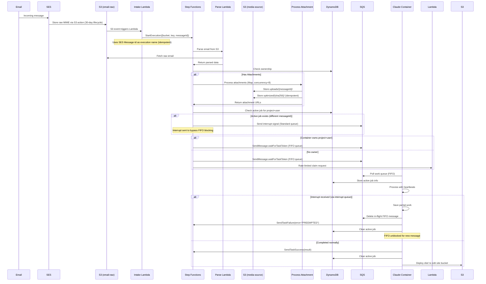

# REFACTOR_PROPOSAL.md

## Executive Summary
Deprecate Hermes message orchestration service and replace with AWS Step Functions (Standard) for email processing and SQS coordination. Email attachments are stored in S3 with high-quality optimized web formats (AVIF + JPEG fallback) for Claude pod usage. Only files that end up in Astro's dist folder after build are published to the internet. Preserve claude-code-container as the long-running ECS/Fargate worker with interrupt semantics.

## 1. Current State Analysis

### Services & Components

#### Hermes Service (`/hermes/`)
- **Location**: `/hermes/src/` (NestJS TypeScript)
- **Main**: `/hermes/src/main.ts`
- **Key Services**:
  - `EmailProcessorService` (`/hermes/src/modules/email-processor/email-processor.service.ts`)
  - `MessageRouterService` (`/hermes/src/modules/message-processor/message-router.service.ts`)
  - `QueueManagerService` (`/hermes/src/modules/sqs/queue-manager.service.ts`)
- **Infrastructure**: `/hephaestus/lib/hermes-stack.ts` (HermesStack)
- **Scripts**: Referenced in `scripts/start-hybrid-dev.sh`, `scripts/start-local-dev.sh`
- **Docker**: `/hermes/Dockerfile`, `/hermes/docker-compose.local.yml`

#### Claude Code Container (`/claude-code-container/`)
- **Location**: `/claude-code-container/src/` (NestJS TypeScript)
- **Main**: `/claude-code-container/src/main.ts`
- **Queue Handler**: `/claude-code-container/src/services/queue-manager.service.ts`
- **Message Processor**: `/claude-code-container/src/services/message-processor.service.ts`
- **Infrastructure**: `/hephaestus/lib/fargate-stack.ts` (FargateStack)

#### Infrastructure (`/hephaestus/`)
- **SQS Stack**: `/hephaestus/lib/sqs-stack.ts`
  - Tables: `webordinary-thread-mappings`, `webordinary-container-ownership`, `webordinary-queue-tracking`, `webordinary-active-jobs`
  - Queues: `webordinary-unclaimed`, `webordinary-interrupts` (Standard), per-project FIFO queues dynamically created
- **Email Stack**: `/hephaestus/lib/email-processing-stack.ts` (SES configuration)

### Current Message Flow
```
Email → SES → SQS(webordinary-email-queue) → Hermes → Parse/Route → SQS(project+user) → Container → S3
```

### Interrupt Mechanism
- Container polls `UNCLAIMED_QUEUE_URL` for new work
- Claims project+user via DynamoDB `webordinary-container-ownership`
- Processes messages from project-specific queue
- On newer message: abandons current work, processes new message

## 2. Target Architecture



### Key Architecture Benefits
- **Small Payloads**: SES stores raw email to S3; Step Functions only handles pointers
- **Idempotent Processing**: SES Message-Id as execution name prevents duplicates
- **Complete Audit Trail**: Every email becomes a Step Functions execution with full visibility
- **Unified Error Handling**: All failures tracked in Step Functions with clear PREEMPTED vs FAILED paths
- **Replay Capability**: Can replay failed executions from any step using S3 stored email
- **Smart Routing**: Checks DynamoDB ownership table to determine container claiming
  - If claimed: Routes only to project+user queue
  - If unclaimed: Routes to both project+user queue AND unclaimed queue
- **True Preemption**: Separate Standard SQS interrupt queue bypasses FIFO blocking
  - Active job tracking in DynamoDB
  - Interrupt consumer deletes in-flight FIFO message to unblock newer work
- **Long Task Support**: Heartbeats every 60s for tasks up to 60 minutes
- **Scale & Performance**: Configurable Map concurrency (default 8) for attachment processing
- **Simplified Architecture**: No output queue needed - containers callback directly to Step Functions
  - Reduces queue management overhead
  - Eliminates output queue polling
  - Direct result transmission via SendTaskSuccess/Failure

### Bucket Layout (Per-Project)
```
# Media source bucket (for Claude pod access during build)
media-source.amelia.webordinary.com/
├── {sha256}/                    # Content-addressed immutable storage (images)
│   ├── master.avif              # High-quality AVIF (q=85, lossy)
│   ├── master.jpg OR master.png # Fallback: JPEG (q=90, lossy) or PNG (lossless for transparency)
│   └── meta.json                # Original filename, message ID, upload date
├── manifests/                   # Per-message attachment manifests
│   └── {message_id}.json        # Maps original filenames to SHA256 IDs
└── documents/                   # Non-image files (PDFs, docs, etc.)
    └── {message_id}/
        └── {filename}           # Original documents as-is

# Raw email storage (SES managed, 30-day lifecycle)
webordinary-ses-emails/
└── {prefix}/{message_id}        # Complete raw MIME message (deleted after 30 days)

# Existing site buckets (unchanged)
edit.amelia.webordinary.com/     # Edit site with Astro dist/
amelia.webordinary.com/           # Production site with Astro dist/
```

### Queue Architecture
```
# Per-project+user queues (manually created for PoC)
webordinary-input-{projectId}-{userId}.fifo
├── MessageGroupId: {projectId}#{userId}
├── Guarantees: One in-flight job per project+user
└── ContentBasedDeduplication: true

webordinary-interrupts-{projectId}-{userId}
├── Type: Standard (not FIFO)
├── Purpose: Fast preemption signals for specific container
├── Per-project+user: Each container monitors its own interrupt queue
└── No ordering guarantees needed

# NO OUTPUT QUEUE NEEDED
# Container sends results directly to Step Functions via SendTaskSuccess/Failure
# This eliminates the need for webordinary-output-* queues entirely

# DynamoDB active jobs table (new)
webordinary-active-jobs
├── PK: projectUserKey ({projectId}#{userId})
├── Attributes:
│   ├── messageId: Current message being processed
│   ├── taskToken: Step Functions callback token
│   ├── receiptHandle: SQS receipt for deletion
│   ├── startedAt: Timestamp
│   └── ttl: Cleanup after 2 hours
└── Purpose: Track active work for interruption
```

### Media Processing Architecture

#### Overview
Email attachments are processed and stored in S3 for Claude pod access during work. The Claude pod decides what to include in the site. Astro handles final optimization during build, and only files in the dist folder are published.

1. **Attachment Processing**: Optimize images, keep documents as-is
2. **Claude Access**: Pod references S3 URLs and decides what to include
3. **Astro Build**: Pulls referenced content (images, PDFs, docs) and processes them
4. **Publishing**: Only Astro dist/ contents go to public site (may include PDFs/docs if Claude included them)

#### Astro Configuration with Presigned URLs
```javascript
// astro.config.mjs
export default defineConfig({
  // Point cache to EFS mount for persistence across builds
  cacheDir: '/mnt/efs/workspace/amelia/.astro-cache',
  
  // Allow S3 presigned URLs - tightened to specific buckets only
  image: {
    remotePatterns: [{
      protocol: 'https',
      hostname: 'media-source.amelia.webordinary.com.s3.us-west-2.amazonaws.com',
    }, {
      protocol: 'https',
      hostname: 'media-source.amelia.webordinary.com.s3.amazonaws.com',
    }],
    service: {
      entrypoint: 'astro/assets/services/sharp',
    },
  },
});
```

#### Container Workflow
```javascript
// Container CONSUMES already-processed attachments from Lambda
// It does NOT write to S3 media buckets - that's the Lambda's job
async function handleProcessedAttachments(attachments) {
  // Attachments were already processed and stored by process-attachment-lambda
  // Container's job is to decide what to include in the Astro site
  
  for (const attachment of attachments) {
    const { filename, mimeType, avifUrl, fallbackUrl, s3Url } = attachment;
    
    // Claude decides what to include in the site
    if (shouldIncludeInSite(filename, mimeType)) {
      if (mimeType.startsWith('image/')) {
        // Reference the pre-processed image URLs
        // NOTE: Validate that Astro's Image component works with presigned URLs
        // Fallback option: Use plain  or pre-fetch to local during build
        await updateAstroContent(`
          ---
          import { Image } from 'astro:assets';
          ---
          
          <!-- Option 1: Astro Image component (test with real presigned URLs) -->
          <Image 
            src="${avifUrl}"
            alt="${filename}"
            width={1600}
            height={900}
            widths={[480, 960, 1600]}
            sizes="(max-width: 480px) 480px, (max-width: 960px) 960px, 1600px"
            formats={['avif', 'webp', 'jpeg']}
          />
          
          <!-- Option 2 (if above fails): Plain picture element -->
          <!--
          <picture>
            <source srcset="${avifUrl}" type="image/avif">
            <source srcset="${fallbackUrl}" type="${attachment.fallbackType}">
            
          </picture>
          -->
        `);
      } else {
        // Reference document for download
        await updateAstroContent(`
          <a href="${s3Url}" download="${filename}">
            Download ${filename}
          </a>
        `);
      }
    }
    
    // Use documents for context (read-only access)
    if (['pdf', 'doc', 'docx', 'txt'].some(ext => filename.toLowerCase().endsWith(ext))) {
      await claudeService.addContext(s3Url, mimeType);
    }
  }
}
```

#### Benefits of This Approach

1. **Simplified Storage**: One folder per message, no duplicate storage (originals in SES bucket)
2. **Claude Control**: Pod decides what documents/images to include in the site
3. **Flexible Documents**: PDFs/docs can be published or just used for context
4. **Astro Optimization**: Final optimization happens at build time
5. **Security**: Only explicitly referenced content ends up in dist/
6. **Efficiency**: EFS cache prevents reprocessing unchanged content

#### Publishing Workflow
```javascript
// The container builds the Astro site but deployment to S3 happens within the container
// This is part of the container's responsibility after Claude completes work

// In claude-code-container after Astro build:
async function deployBuiltSite(projectId) {
  const distPath = `/mnt/efs/workspace/${projectId}/dist`;
  
  // Astro has:
  // 1. Downloaded only referenced images from S3 presigned URLs
  // 2. Optimized them into needed sizes/formats
  // 3. Included them in dist/_astro/
  // 4. Generated HTML with proper paths
  
  // The container syncs dist/ to the edit site bucket
  // This is the ONLY S3 write the container performs
  await s3.sync(distPath, `s3://edit.amelia.webordinary.com/`);
  
  console.log(`Deployed Astro dist/ to edit site`);
}

// Note: All media/attachment storage is handled by process-attachment-lambda
// The container only reads from media buckets and writes final site to edit bucket
```

### CloudFront Configuration (Per-Project)

#### Edit Distribution (edit.amelia.webordinary.com)
- **Origin**: S3 `edit.amelia.webordinary.com` (contains Astro dist/)
- **Behaviors**:
  - `/_astro/*` → TTL: 31536000 (1 year - immutable, hashed assets)
  - `/*` → TTL: 60 (1 min - frequent changes)

#### Production Distribution (amelia.webordinary.com)
- **Origin**: S3 `amelia.webordinary.com` (contains Astro dist/)
- **Behaviors**:
  - `/_astro/*` → TTL: 31536000 (1 year - immutable, hashed assets)
  - `/*` → TTL: 300 (5 min)

## 3. Infrastructure Changes (CDK)

### New Stacks

#### Client-Specific Resources (Manual Setup for Each Client)
```bash
# These resources are created manually per client during onboarding
# Future: This will be automated via client onboarding script

# 1. Create Media Source Bucket for Amelia project
aws s3api create-bucket \
  --bucket media-source.amelia.webordinary.com \
  --region us-west-2 \
  --create-bucket-configuration LocationConstraint=us-west-2

# Configure encryption and access
aws s3api put-bucket-encryption \
  --bucket media-source.amelia.webordinary.com \
  --server-side-encryption-configuration '{"Rules":[{"ApplyServerSideEncryptionByDefault":{"SSEAlgorithm":"AES256"}}]}'

aws s3api put-public-access-block \
  --bucket media-source.amelia.webordinary.com \
  --public-access-block-configuration "BlockPublicAcls=true,IgnorePublicAcls=true,BlockPublicPolicy=true,RestrictPublicBuckets=true"

# Add lifecycle rules for 30-day cleanup
aws s3api put-bucket-lifecycle-configuration \
  --bucket media-source.amelia.webordinary.com \
  --lifecycle-configuration file://media-source-lifecycle.json

# 2. Create interrupt queue for amelia-scott
aws sqs create-queue \
  --queue-name webordinary-interrupts-amelia-scott \
  --attributes VisibilityTimeout=60,MessageRetentionPeriod=86400

# 3. Existing client resources (already created):
# - webordinary-input-amelia-scott.fifo
# - webordinary-dlq-amelia-scott.fifo
# - edit.amelia.webordinary.com (S3 bucket)
# - amelia.webordinary.com (S3 bucket)
# Note: Output queue no longer needed with Step Functions callbacks
```

#### Media Source Lifecycle Configuration (media-source-lifecycle.json)
```json
{
  "Rules": [
    {
      "Id": "transition-optimized-web-images",
      "Status": "Enabled",
      "Filter": { "Prefix": "" },
      "Transitions": [
        {
          "Days": 30,
          "StorageClass": "STANDARD_IA"
        },
        {
          "Days": 365,
          "StorageClass": "GLACIER_INSTANT_RETRIEVAL"
        }
      ],
      "NoncurrentVersionExpiration": {
        "NoncurrentDays": 7
      }
    },
    {
      "Id": "expire-temporary-documents",
      "Status": "Enabled",
      "Filter": { "Prefix": "documents/" },
      "Expiration": { "Days": 90 }
    },
    {
      "Id": "expire-manifests",
      "Status": "Enabled",
      "Filter": { "Prefix": "manifests/" },
      "Expiration": { "Days": 30 }
    }
  ]
}
```

#### SES Raw Email Lifecycle (ses-lifecycle.json)
```json
{
  "Rules": [
    {
      "Id": "cleanup-raw-emails",
      "Status": "Enabled",
      "Expiration": { "Days": 30 }
    }
  ]
}
```

#### LambdaStack (`/hephaestus/lib/lambda-stack.ts`)
```typescript
import * as lambda from 'aws-cdk-lib/aws-lambda';
import * as destinations from 'aws-cdk-lib/aws-lambda-destinations';
import * as sqs from 'aws-cdk-lib/aws-sqs';
import * as iam from 'aws-cdk-lib/aws-iam';
import { Fn } from 'aws-cdk-lib';

export class LambdaStack extends cdk.Stack {
  public readonly intakeLambda: lambda.Function;
  public readonly parseEmailLambda: lambda.Function;
  public readonly processAttachmentLambda: lambda.Function;
  public readonly checkActiveJobLambda: lambda.Function;
  public readonly rateLimitedClaimLambda: lambda.Function;
  public readonly recordInterruptionLambda: lambda.Function;

  constructor(scope: Construct, id: string, props?: cdk.StackProps) {
    super(scope, id, props);

    // Create DLQ for intake Lambda failures
    const intakeLambdaDLQ = new sqs.Queue(this, 'IntakeLambdaDLQ', {
      queueName: 'webordinary-intake-lambda-dlq',
      retentionPeriod: cdk.Duration.days(14),
    });

    // Intake Lambda - triggers Step Functions from S3 events
    this.intakeLambda = new lambda.Function(this, 'IntakeEmailLambda', {
      runtime: lambda.Runtime.NODEJS_20_X,
      architecture: lambda.Architecture.ARM_64,
      handler: 'index.handler',
      code: lambda.Code.fromAsset('lambda/intake-email'),
      timeout: cdk.Duration.seconds(30),
      memorySize: 512,
      environment: {
        STATE_MACHINE_ARN: Fn.importValue('EmailProcessorStateMachineArn'),
        MAP_MAX_CONCURRENCY: process.env.MAP_MAX_CONCURRENCY || '8',
        EMAIL_DLQ_URL: `https://sqs.${this.region}.amazonaws.com/${this.account}/webordinary-email-dlq`,
      },
      reservedConcurrentExecutions: 10, // Prevent throttling from S3 event bursts
      deadLetterQueue: intakeLambdaDLQ,
      maxEventAge: cdk.Duration.hours(2),
      retryAttempts: 2,
      onFailure: new destinations.SqsDestination(intakeLambdaDLQ),
    });

    // Grant permission to start Step Functions executions
    this.intakeLambda.addToRolePolicy(new iam.PolicyStatement({
      actions: ['states:StartExecution'],
      resources: [Fn.importValue('EmailProcessorStateMachineArn')],
    }));
    
    // Grant S3 read access for email bucket
    this.intakeLambda.addToRolePolicy(new iam.PolicyStatement({
      actions: ['s3:GetObject'],
      resources: ['arn:aws:s3:::webordinary-ses-emails/*'],
    }));

    // Process Attachment Lambda - stores and optimizes attachments
    this.processAttachmentLambda = new lambda.DockerImageFunction(this, 'ProcessAttachmentLambda', {
      code: lambda.DockerImageCode.fromImageAsset('lambda/process-attachment'),
      architecture: lambda.Architecture.ARM_64,
      timeout: cdk.Duration.seconds(60),
      memorySize: 1024,
      environment: {
        NODE_OPTIONS: '--max-old-space-size=896',
        MAP_MAX_CONCURRENCY: process.env.MAP_MAX_CONCURRENCY || '8',
        PRESIGNED_URL_TTL_HOURS: process.env.PRESIGNED_URL_TTL_HOURS || '72', // Default 72h for build retries
      },
    });

    // Grant S3 access for media source bucket - scoped to amelia ONLY for PoC
    // Future: Use tags or parameters for multi-client support
    this.processAttachmentLambda.addToRolePolicy(new iam.PolicyStatement({
      actions: ['s3:GetObject', 's3:PutObject', 's3:HeadObject'],
      resources: [
        'arn:aws:s3:::media-source.amelia.webordinary.com/*',
      ],
    }));

    // Parse Email Lambda - extracts email content from S3
    this.parseEmailLambda = new lambda.Function(this, 'ParseEmailLambda', {
      runtime: lambda.Runtime.NODEJS_20_X,
      architecture: lambda.Architecture.ARM_64,
      handler: 'index.handler',
      code: lambda.Code.fromAsset('lambda/parse-email'),
      timeout: cdk.Duration.seconds(30),
      memorySize: 512,
      environment: {
        SES_BUCKET: 'webordinary-ses-emails',
      },
    });
    
    // Grant S3 read access for raw email bucket
    this.parseEmailLambda.addToRolePolicy(new iam.PolicyStatement({
      actions: ['s3:GetObject'],
      resources: ['arn:aws:s3:::webordinary-ses-emails/*'],
    }));

    // No manifest lambda needed - Astro handles all asset tracking
    
    // Check Active Job Lambda - checks if job is running and sends interrupt
    this.checkActiveJobLambda = new lambda.Function(this, 'CheckActiveJobLambda', {
      runtime: lambda.Runtime.NODEJS_20_X,
      architecture: lambda.Architecture.ARM_64,
      handler: 'index.handler',
      code: lambda.Code.fromAsset('lambda/check-active-job'),
      timeout: cdk.Duration.seconds(10),
      environment: {
        ACTIVE_JOBS_TABLE: 'webordinary-active-jobs',
        INTERRUPT_QUEUE_URL_PATTERN: 'https://sqs.{region}.amazonaws.com/{account}/webordinary-interrupts-{projectId}-{userId}',
      },
    });
    
    // Grant permissions
    this.checkActiveJobLambda.addToRolePolicy(new iam.PolicyStatement({
      actions: ['dynamodb:GetItem'],
      resources: ['arn:aws:dynamodb:*:*:table/webordinary-active-jobs'],
    }));
    
    this.checkActiveJobLambda.addToRolePolicy(new iam.PolicyStatement({
      actions: ['sqs:SendMessage'],
      resources: ['arn:aws:sqs:*:*:webordinary-interrupts-*'],
    }));

    // Rate-limited claim Lambda
    this.rateLimitedClaimLambda = new lambda.Function(this, 'RateLimitedClaimLambda', {
      runtime: lambda.Runtime.NODEJS_20_X,
      architecture: lambda.Architecture.ARM_64,
      handler: 'index.handler',
      code: lambda.Code.fromAsset('lambda/rate-limited-claim'),
      timeout: cdk.Duration.seconds(10),
      environment: {
        CLAIM_REQUESTS_TABLE: 'webordinary-claim-requests',
        UNCLAIMED_QUEUE_URL: 'https://sqs.us-west-2.amazonaws.com/942734823970/webordinary-unclaimed',
      },
    });
    
    // Grant permissions for claim requests table
    this.rateLimitedClaimLambda.addToRolePolicy(new iam.PolicyStatement({
      actions: ['dynamodb:PutItem'],
      resources: ['arn:aws:dynamodb:*:*:table/webordinary-claim-requests'],
    }));
    
    // Grant permission to send to unclaimed queue
    this.rateLimitedClaimLambda.addToRolePolicy(new iam.PolicyStatement({
      actions: ['sqs:SendMessage'],
      resources: ['arn:aws:sqs:*:*:webordinary-unclaimed'],
    }));

    // Record Interruption Lambda
    this.recordInterruptionLambda = new lambda.Function(this, 'RecordInterruptionLambda', {
      runtime: lambda.Runtime.NODEJS_20_X,
      architecture: lambda.Architecture.ARM_64,
      handler: 'index.handler',
      code: lambda.Code.fromAsset('lambda/record-interruption'),
      timeout: cdk.Duration.seconds(30),
    });

    // Grant DynamoDB write for interruptions table
    this.recordInterruptionLambda.addToRolePolicy(new iam.PolicyStatement({
      actions: ['dynamodb:PutItem', 'dynamodb:UpdateItem'],
      resources: [
        'arn:aws:dynamodb:*:*:table/webordinary-interruptions',
        'arn:aws:dynamodb:*:*:table/webordinary-thread-mappings',
      ],
    }));

    // Output Lambda ARNs for use in other stacks
    new cdk.CfnOutput(this, 'IntakeLambdaArn', {
      value: this.intakeLambda.functionArn,
      exportName: 'IntakeLambdaArn',
    });
    
    // Export other Lambda ARNs
    new cdk.CfnOutput(this, 'ParseEmailLambdaArn', {
      value: this.parseEmailLambda.functionArn,
      exportName: 'ParseEmailLambdaArn',
    });
    
    new cdk.CfnOutput(this, 'ProcessAttachmentLambdaArn', {
      value: this.processAttachmentLambda.functionArn,
      exportName: 'ProcessAttachmentLambdaArn',
    });
    
    new cdk.CfnOutput(this, 'CheckActiveJobLambdaArn', {
      value: this.checkActiveJobLambda.functionArn,
      exportName: 'CheckActiveJobLambdaArn',
    });
    
    new cdk.CfnOutput(this, 'RateLimitedClaimLambdaArn', {
      value: this.rateLimitedClaimLambda.functionArn,
      exportName: 'RateLimitedClaimLambdaArn',
    });
    
    new cdk.CfnOutput(this, 'RecordInterruptionLambdaArn', {
      value: this.recordInterruptionLambda.functionArn,
      exportName: 'RecordInterruptionLambdaArn',
    });
  }
}
```

#### StepFunctionsStack (`/hephaestus/lib/stepfunctions-stack.ts`)
```typescript
import * as sfn from 'aws-cdk-lib/aws-stepfunctions';
import * as tasks from 'aws-cdk-lib/aws-stepfunctions-tasks';
import * as s3 from 'aws-cdk-lib/aws-s3';
import * as s3n from 'aws-cdk-lib/aws-s3-notifications';
import * as logs from 'aws-cdk-lib/aws-logs';
import * as lambda from 'aws-cdk-lib/aws-lambda';
import * as dynamodb from 'aws-cdk-lib/aws-dynamodb';
import * as iam from 'aws-cdk-lib/aws-iam';
import { Fn } from 'aws-cdk-lib';

export class StepFunctionsStack extends cdk.Stack {
  constructor(scope: Construct, id: string, props?: cdk.StackProps) {
    super(scope, id, props);

    // Import Lambda functions from LambdaStack
    const intakeLambda = lambda.Function.fromFunctionArn(
      this, 'IntakeLambda', Fn.importValue('IntakeLambdaArn')
    );
    const parseEmailLambda = lambda.Function.fromFunctionArn(
      this, 'ParseEmailLambda', Fn.importValue('ParseEmailLambdaArn')
    );
    const processAttachmentLambda = lambda.Function.fromFunctionArn(
      this, 'ProcessAttachmentLambda', Fn.importValue('ProcessAttachmentLambdaArn')
    );
    const checkActiveJobLambda = lambda.Function.fromFunctionArn(
      this, 'CheckActiveJobLambda', Fn.importValue('CheckActiveJobLambdaArn')
    );
    const recordInterruptionLambda = lambda.Function.fromFunctionArn(
      this, 'RecordInterruptionLambda', Fn.importValue('RecordInterruptionLambdaArn')
    );
    const rateLimitedClaimLambda = lambda.Function.fromFunctionArn(
      this, 'RateLimitedClaimLambda', Fn.importValue('RateLimitedClaimLambdaArn')
    );

    // Parse email task - uses the actual Lambda function reference
    const parseEmailTask = new tasks.LambdaInvoke(this, 'ParseEmail', {
      lambdaFunction: parseEmailLambda,
      outputPath: '$.Payload',
    });

    // Check ownership task
    const checkOwnership = new tasks.DynamoGetItem(this, 'CheckOwnership', {
      table: dynamodb.Table.fromTableName(this, 'OwnershipTable', 'webordinary-container-ownership'),
      key: {
        projectKey: tasks.DynamoAttributeValue.fromString(
          sfn.JsonPath.format('{}#{}', sfn.JsonPath.stringAt('$.projectId'), sfn.JsonPath.stringAt('$.userId'))
        ),
      },
      resultPath: '$.ownership',
    });

    // Check active job task - uses the actual Lambda function reference
    const checkActiveJob = new tasks.LambdaInvoke(this, 'CheckActiveJob', {
      lambdaFunction: checkActiveJobLambda,
      outputPath: '$.Payload',
      resultPath: '$.activeJobCheck',
    });

    // Create states first so we can reference them
    const routeToProjectQueue = new tasks.SqsSendMessage(this, 'RouteToProjectQueue', {
      queue: sqs.Queue.fromQueueArn(this, 'ProjectQueue', 
        sfn.JsonPath.stringAt('$.queueUrl')
      ),
      messageBody: sfn.TaskInput.fromObject({
        taskToken: sfn.JsonPath.taskToken,
        messageId: sfn.JsonPath.stringAt('$.messageId'),
        instruction: sfn.JsonPath.stringAt('$.body'),
        threadId: sfn.JsonPath.stringAt('$.threadId'),
        attachments: sfn.JsonPath.objectAt('$.processedAttachments'),
        projectId: sfn.JsonPath.stringAt('$.projectId'),
        userId: sfn.JsonPath.stringAt('$.userId'),
      }),
      integrationPattern: sfn.IntegrationPattern.WAIT_FOR_TASK_TOKEN,
      heartbeat: cdk.Duration.seconds(60),
    });
    
    const routeToQueuesWithClaim = new sfn.Parallel(this, 'RouteToQueuesWithClaim');
    // ... configure parallel branches
    
    // Determine routing choice using object references
    const determineRouting = new sfn.Choice(this, 'DetermineRouting')
      .when(sfn.Condition.isPresent('$.ownership.Item'), routeToProjectQueue)
      .otherwise(routeToQueuesWithClaim);

    // Process attachments map state (using parameterized concurrency)
    const processAttachmentsMap = new sfn.Map(this, 'ProcessAttachments', {
      itemsPath: '$.attachments',
      maxConcurrency: sfn.JsonPath.numberAt('$.mapMaxConcurrency'),
      parameters: {
        'attachment.$': '$$.Map.Item.Value',
        'messageId.$': '$.messageId',
        'projectId.$': '$.projectId',
      },
    });
    
    processAttachmentsMap.iterator(
      new tasks.LambdaInvoke(this, 'ProcessAttachment', {
        lambdaFunction: processAttachmentLambda,
        outputPath: '$.Payload',
      })
    );

    // Build the state machine definition using object references
    const checkAttachments = new sfn.Choice(this, 'CheckAttachments')
      .when(sfn.Condition.isPresent('$.attachments'), processAttachmentsMap)
      .otherwise(checkOwnership);
    
    // Chain states together
    processAttachmentsMap.next(checkOwnership);
    checkOwnership.next(checkActiveJob);
    checkActiveJob.next(determineRouting);
    
    const definition = parseEmailTask.next(checkAttachments);

    // Create the state machine
    const stateMachine = new sfn.StateMachine(this, 'EmailProcessor', {
      stateMachineName: 'webordinary-email-processor',
      stateMachineType: sfn.StateMachineType.STANDARD,
      definition,
      logs: {
        destination: new logs.LogGroup(this, 'StateMachineLogs', {
          logGroupName: '/aws/stepfunctions/webordinary',
          retention: logs.RetentionDays.ONE_WEEK,
        }),
        level: sfn.LogLevel.ALL,
      },
      tracingConfig: {
        enabled: true,
      },
    });
    
    // Export state machine ARN for Fargate task role permissions
    new cdk.CfnOutput(this, 'EmailProcessorStateMachineArn', {
      value: stateMachine.stateMachineArn,
      exportName: 'EmailProcessorStateMachineArn',
    });

    // SES writes to S3, S3 event triggers intake Lambda which starts Step Functions
    // Flow: SES → S3 → Intake Lambda → Step Functions
    
    // Import SES emails bucket from SqsStack
    const sesEmailBucket = s3.Bucket.fromBucketName(
      this,
      'SESEmailBucket',
      Fn.importValue('SESEmailBucketName')
    );
    
    // Grant intake Lambda permission to be invoked by S3
    intakeLambda.addPermission('AllowS3', {
      principal: new iam.ServicePrincipal('s3.amazonaws.com'),
      sourceAccount: this.account,
      sourceArn: sesEmailBucket.bucketArn,
    });
    
    // Add S3 event notification to trigger intake Lambda
    // Note: Lambda has its own DLQ for handling failures
    sesEmailBucket.addEventNotification(
      s3.EventType.OBJECT_CREATED,
      new s3n.LambdaDestination(intakeLambda)
    );
  }
}
```

### Modified Stacks

#### Update SqsStack (`/hephaestus/lib/sqs-stack.ts`)
```typescript
import * as s3 from 'aws-cdk-lib/aws-s3';

// Note: Interrupt queues are created manually per project+user for now
// They follow the pattern: webordinary-interrupts-{projectId}-{userId}
// These are Standard queues (not FIFO) for fast interrupt delivery

// Add S3 bucket for SES raw emails (client-agnostic)
const sesEmailBucket = new s3.Bucket(this, 'SESEmailBucket', {
  bucketName: 'webordinary-ses-emails',
  encryption: s3.BucketEncryption.S3_MANAGED,
  blockPublicAccess: s3.BlockPublicAccess.BLOCK_ALL,
  lifecycleRules: [{
    id: 'cleanup-raw-emails',
    expiration: cdk.Duration.days(30),
  }],
  removalPolicy: cdk.RemovalPolicy.RETAIN,
});

// Add active jobs table
const activeJobsTable = new dynamodb.Table(this, 'ActiveJobsTable', {
  tableName: 'webordinary-active-jobs',
  partitionKey: {
    name: 'projectUserKey',
    type: dynamodb.AttributeType.STRING,
  },
  billingMode: dynamodb.BillingMode.PAY_PER_REQUEST,
  removalPolicy: cdk.RemovalPolicy.RETAIN,
  timeToLiveAttribute: 'ttl',
});

// Add claim requests table for rate limiting
const claimRequestsTable = new dynamodb.Table(this, 'ClaimRequestsTable', {
  tableName: 'webordinary-claim-requests',
  partitionKey: {
    name: 'projectUserKey',
    type: dynamodb.AttributeType.STRING,
  },
  billingMode: dynamodb.BillingMode.PAY_PER_REQUEST,
  removalPolicy: cdk.RemovalPolicy.RETAIN,
  timeToLiveAttribute: 'ttl',
});

// Export for other stacks
new cdk.CfnOutput(this, 'SESEmailBucketName', {
  value: sesEmailBucket.bucketName,
  exportName: 'SESEmailBucketName',
});

new cdk.CfnOutput(this, 'ActiveJobsTableName', {
  value: activeJobsTable.tableName,
  exportName: 'ActiveJobsTableName',
});
```

#### Remove HermesStack
- Destroy Hermes stack deployment on aws.
- Delete `/hephaestus/lib/hermes-stack.ts`
- Remove from `/hephaestus/bin/hephaestus.ts`
- Clean up exports/imports

#### Update FargateStack (`/hephaestus/lib/fargate-stack.ts`)
```typescript
// Add Step Functions callback permissions to task role - scope to specific state machine
taskRole.addToPolicy(new iam.PolicyStatement({
  effect: iam.Effect.ALLOW,
  actions: [
    'states:SendTaskSuccess',
    'states:SendTaskFailure', 
    'states:SendTaskHeartbeat',
  ],
  resources: [Fn.importValue('EmailProcessorStateMachineArn')],
}));

// Add media source bucket access for Claude pod - scoped to amelia ONLY for PoC
taskRole.addToPolicy(new iam.PolicyStatement({
  effect: iam.Effect.ALLOW,
  actions: [
    's3:GetObject',
    's3:ListBucket',
  ],
  resources: [
    'arn:aws:s3:::media-source.amelia.webordinary.com',
    'arn:aws:s3:::media-source.amelia.webordinary.com/*',
  ],
}));

// Site bucket access - scoped to amelia ONLY for PoC
taskRole.addToPolicy(new iam.PolicyStatement({
  effect: iam.Effect.ALLOW,
  actions: [
    's3:PutObject',
    's3:DeleteObject',
  ],
  resources: [
    'arn:aws:s3:::edit.amelia.webordinary.com/*',
    'arn:aws:s3:::amelia.webordinary.com/*',
  ],
}));

// Update container environment variables
container.addEnvironment('MEDIA_SOURCE_BUCKET_PATTERN', 'media-source.{projectId}.webordinary.com');
container.addEnvironment('EDIT_SITE_BUCKET_PATTERN', 'edit.{projectId}.webordinary.com');
container.addEnvironment('PROD_SITE_BUCKET_PATTERN', '{projectId}.webordinary.com');
container.addEnvironment('INTERRUPT_QUEUE_URL_PATTERN', 'https://sqs.{region}.amazonaws.com/{account}/webordinary-interrupts-{projectId}-{userId}');
container.addEnvironment('ACTIVE_JOBS_TABLE', 'webordinary-active-jobs');
container.addEnvironment('STATE_MACHINE_ARN', Fn.importValue('EmailProcessorStateMachineArn'));

// Grant permissions for interrupt handling - scoped to amelia for PoC
// Future: Use tags or parameter-based pattern for multi-client
taskRole.addToPolicy(new iam.PolicyStatement({
  effect: iam.Effect.ALLOW,
  actions: [
    'sqs:ReceiveMessage',
    'sqs:DeleteMessage',
  ],
  resources: ['arn:aws:sqs:*:*:webordinary-interrupts-amelia-*'],
}));

taskRole.addToPolicy(new iam.PolicyStatement({
  effect: iam.Effect.ALLOW,
  actions: [
    'dynamodb:PutItem',
    'dynamodb:DeleteItem',
    'dynamodb:GetItem',
  ],
  resources: ['arn:aws:dynamodb:*:*:table/webordinary-active-jobs'],
}));
```

## 4. Lambda Functions

### intake-lambda
- **Package**: ZIP (minimal dependencies)
- **Runtime**: Node.js 20.x ARM64
- **Handler**: `index.handler`
- **Purpose**: Start Step Functions execution with S3 pointer
- **Invoked by**: S3 event notification (after SES writes raw email to S3)
```javascript
export const handler = async (event) => {
  // Event shape from S3 ObjectCreated:* notification
  // {
  //   "Records": [{
  //     "eventSource": "aws:s3",
  //     "eventName": "ObjectCreated:Put",
  //     "s3": {
  //       "bucket": { "name": "webordinary-ses-emails" },
  //       "object": { 
  //         "key": "incoming/abc123-def456-messageId",
  //         "size": 123456
  //       }
  //     }
  //   }]
  // }
  
  const AWS = require('aws-sdk');
  const stepFunctions = new AWS.StepFunctions();
  
  const s3Event = event.Records[0].s3;
  const bucket = s3Event.bucket.name;
  const key = decodeURIComponent(s3Event.object.key.replace(/\+/g, ' '));
  
  // Extract message ID from S3 key (SES format: {prefix}/{messageId})
  const messageId = key.split('/').pop();
  
  // Start Step Functions execution with S3 pointer (not full MIME payload)
  // This keeps the state machine input small and efficient
  try {
    const execution = await stepFunctions.startExecution({
      stateMachineArn: process.env.STATE_MACHINE_ARN,
      name: messageId.replace(/[^a-zA-Z0-9_-]/g, '-'), // Idempotent execution name
      input: JSON.stringify({
        bucket,
        key,
        messageId,
        mapMaxConcurrency: parseInt(process.env.MAP_MAX_CONCURRENCY || '8'),
        emailDLQUrl: process.env.EMAIL_DLQ_URL, // Injected by CDK
      }),
    }).promise();
    
    console.log(`Started Step Functions execution: ${execution.executionArn}`);
  } catch (error) {
    if (error.code === 'ExecutionAlreadyExists') {
      // This is fine - idempotent operation, duplicate S3 event
      console.log(`Execution already exists for message ${messageId}, treating as success`);
      return { statusCode: 200, body: 'OK - Already processing' };
    }
    throw error; // Re-throw other errors
  }
  
  return { statusCode: 200, body: 'OK' };
};
```

### parse-email-lambda
- **Package**: ZIP
- **Runtime**: Node.js 20.x ARM64
- **Handler**: `index.handler`
- **Purpose**: Parse raw email from S3 and extract structured data
- **Invoked by**: Step Functions (first state in the machine)
```javascript
export const handler = async (event, context) => {
  const { bucket, key, messageId } = event;
  
  const AWS = require('aws-sdk');
  const s3 = new AWS.S3();
  const simpleParser = require('mailparser').simpleParser;
  
  try {
    // Fetch raw email from S3
    const rawEmail = await s3.getObject({
      Bucket: bucket,
      Key: key,
    }).promise();
    
    // Parse MIME message
    const parsed = await simpleParser(rawEmail.Body);
    
    // Extract thread ID from headers or generate from subject
    const threadId = parsed.headers.get('references') || 
                    parsed.headers.get('in-reply-to') || 
                    require('crypto').createHash('md5')
                      .update(parsed.subject || 'no-subject')
                      .digest('hex');
    
    // Extract project and user from recipient email
    // Format: project+user@domain.com (e.g., amelia+scott@webordinary.com)
    const to = parsed.to?.value?.[0]?.address || '';
    const match = to.match(/^([^+]+)\+([^@]+)@/);
    const projectId = match?.[1] || 'unknown';
    const userId = match?.[2] || 'unknown';
    
    // Build queue URL for this project+user
    const queueUrl = `https://sqs.${process.env.AWS_REGION}.amazonaws.com/${process.env.AWS_ACCOUNT_ID}/webordinary-input-${projectId}-${userId}.fifo`;
    
    // Process attachments - write to S3 immediately to keep payloads small
    const attachments = [];
    if (parsed.attachments && parsed.attachments.length > 0) {
      for (const attachment of parsed.attachments) {
        // Write attachment to S3
        const attachmentKey = `uploads/${messageId}/${attachment.filename}`;
        await s3.putObject({
          Bucket: process.env.MEDIA_BUCKET || `media-source.${projectId}.webordinary.com`,
          Key: attachmentKey,
          Body: attachment.content,
          ContentType: attachment.contentType,
          Metadata: {
            'message-id': messageId,
            'original-filename': attachment.filename,
          },
        }).promise();
        
        // Return only pointer, not data
        attachments.push({
          filename: attachment.filename,
          mimeType: attachment.contentType,
          size: attachment.size,
          bucket: process.env.MEDIA_BUCKET || `media-source.${projectId}.webordinary.com`,
          key: attachmentKey,
        });
      }
    }
    
    // Return structured data for Step Functions
    return {
      messageId,
      threadId,
      projectId,
      userId,
      queueUrl,
      from: parsed.from?.value?.[0]?.address,
      subject: parsed.subject,
      body: parsed.text || parsed.html,
      attachments: attachments.length > 0 ? attachments : undefined,
      mapMaxConcurrency: event.mapMaxConcurrency,
      emailDLQUrl: event.emailDLQUrl,
    };
  } catch (error) {
    console.error('Failed to parse email:', error);
    throw new Error(`Email parsing failed: ${error.message}`);
  }
};
```

### process-attachment-lambda
- **Package**: Container image (Sharp for optimization)
- **Runtime**: Node.js 20.x ARM64
- **Memory**: 1024 MB
- **Timeout**: 60 seconds
- **Purpose**: Store attachments and create high-quality optimized web versions
```dockerfile
FROM public.ecr.aws/lambda/nodejs:20
RUN npm install sharp@0.33.0
COPY index.js ./
CMD ["index.handler"]
```
```javascript
export const handler = async (event) => {
  const { attachment, messageId, projectId } = event;
  const { bucket, key, filename, mimeType } = attachment;
  
  const AWS = require('aws-sdk');
  const s3 = new AWS.S3();
  const crypto = require('crypto');
  
  // Fetch attachment from S3 (pointer only, not base64 in state)
  const original = await s3.getObject({
    Bucket: bucket,
    Key: key,
  }).promise();
  
  const buffer = original.Body;
  const mediaBucket = bucket; // Use same bucket for derived assets
  
  // If it's an image, create optimized versions
  if (mimeType.startsWith('image/')) {
    const sharp = require('sharp');
    
    // Normalize and resize to reasonable max
    const normalized = await sharp(buffer)
      .rotate() // Auto-rotate based on EXIF
      .resize(3840, 3840, { // Max 4K
        fit: 'inside',
        withoutEnlargement: true,
      });
    
    // Detect if image has alpha channel (transparency)
    const metadata = await sharp(buffer).metadata();
    const hasAlpha = metadata.channels === 4 || metadata.format === 'png';
    
    // Create high-quality AVIF (primary, lossy but efficient)
    const avifMaster = await normalized.clone()
      .avif({ quality: 85, effort: 4 })  // Lossy compression, high quality
      .toBuffer();
    
    // Content-hash addressing - compute BEFORE using it!
    const sha256 = crypto.createHash('sha256').update(avifMaster).digest('hex');
    
    // Create JPEG/PNG fallback based on transparency
    let fallbackBuffer, fallbackKey, fallbackType;
    if (hasAlpha) {
      // PNG for images with transparency (lossless for alpha channel)
      fallbackBuffer = await normalized
        .png({ compressionLevel: 9 })
        .toBuffer();
      fallbackKey = `${sha256}/master.png`;
      fallbackType = 'image/png';
    } else {
      // JPEG for images without transparency (lossy)
      fallbackBuffer = await normalized  
        .jpeg({ quality: 90, mozjpeg: true })  // Lossy compression, high quality
        .toBuffer();
      fallbackKey = `${sha256}/master.jpg`;
      fallbackType = 'image/jpeg';
    }
    
    const avifKey = `${sha256}/master.avif`;
    const metaKey = `${sha256}/meta.json`;
    
    // Check if already exists (deduplication)
    try {
      await s3.headObject({
        Bucket: mediaBucket,
        Key: avifKey,
      });
      console.log(`[${messageId}] Image already exists: ${sha256}`);
    } catch (e) {
      // Doesn't exist, store all versions
      await s3.putObject({
        Bucket: mediaBucket,
        Key: avifKey,
        Body: avifMaster,
        ContentType: 'image/avif',
      });
      
      await s3.putObject({
        Bucket: mediaBucket,
        Key: fallbackKey,
        Body: fallbackBuffer,
        ContentType: fallbackType,
      });
      
      // Store metadata
      await s3.putObject({
        Bucket: mediaBucket,
        Key: metaKey,
        Body: JSON.stringify({
          originalName: filename,
          messageId: messageId,
          uploadDate: new Date().toISOString(),
          mimeType: mimeType,
        }),
        ContentType: 'application/json',
      });
    }
    
    // Update manifest for this message
    const manifestKey = `manifests/${messageId}.json`;
    let manifest = {};
    try {
      const existing = await s3.getObject({
        Bucket: mediaBucket,
        Key: manifestKey,
      });
      manifest = JSON.parse(existing.Body.toString());
    } catch (e) {
      // Manifest doesn't exist yet
    }
    
    manifest[filename] = {
      sha256: sha256,
      type: 'image',
      optimized: true,
    };
    
    await s3.putObject({
      Bucket: mediaBucket,
      Key: manifestKey,
      Body: JSON.stringify(manifest),
      ContentType: 'application/json',
    });
    
    // Generate presigned URLs for private access
    const ttlSeconds = parseInt(process.env.PRESIGNED_URL_TTL_HOURS || '72') * 3600;
    const presignedAvif = await s3.getSignedUrlPromise('getObject', {
      Bucket: mediaBucket,
      Key: avifKey,
      Expires: ttlSeconds,
    });
    
    const presignedFallback = await s3.getSignedUrlPromise('getObject', {
      Bucket: mediaBucket,
      Key: fallbackKey,
      Expires: ttlSeconds,
    });
    
    return {
      filename,
      sha256,  // Include SHA256 for deduplication tracking
      avifUrl: presignedAvif,
      fallbackUrl: presignedFallback,
      fallbackType: fallbackType,
      mimeType: 'image/avif',
      isContext: false,  // Images are for display, not context
    };
  }
  
  // For non-images (PDFs, docs, etc), store as-is
  const sha256 = crypto.createHash('sha256').update(buffer).digest('hex');
  const key = `documents/${messageId}/${filename}`;
  
  await s3.putObject({
    Bucket: mediaBucket,
    Key: key,
    Body: buffer,
    ContentType: mimeType,
    Metadata: {
      'message-id': messageId,
      'sha256': sha256,
    },
  });
  
  // Return presigned URL
  const ttlSeconds = parseInt(process.env.PRESIGNED_URL_TTL_HOURS || '72') * 3600;
  return {
    filename,
    sha256,  // Include SHA256 for consistency
    s3Url: await s3.getSignedUrlPromise('getObject', {
      Bucket: mediaBucket,
      Key: key,
      Expires: ttlSeconds,
    }),
    mimeType,
    isContext: true,  // Documents are for context
  };
};
```


### check-active-job-lambda
- **Package**: ZIP
- **Purpose**: Check if active job exists and send interrupt if needed
- **Runtime**: Node.js 20.x ARM64
```javascript
export const handler = async (event) => {
  const { projectId, userId, messageId, sendInterrupt } = event;
  const projectUserKey = `${projectId}#${userId}`;
  
  // Check if there's an active job
  const activeJob = await dynamodb.getItem({
    TableName: process.env.ACTIVE_JOBS_TABLE,
    Key: { projectUserKey: { S: projectUserKey } },
  }).promise();
  
  if (activeJob.Item && activeJob.Item.messageId.S !== messageId) {
    // Different message is being processed
    const isActive = true;
    const activeMessageId = activeJob.Item.messageId.S;
    
    if (sendInterrupt) {
      // Build interrupt queue URL for this project+user
      const interruptQueueUrl = process.env.INTERRUPT_QUEUE_URL_PATTERN
        .replace('{region}', process.env.AWS_REGION)
        .replace('{account}', process.env.AWS_ACCOUNT_ID)
        .replace('{projectId}', projectId)
        .replace('{userId}', userId);
      
      // Send interrupt to Standard queue (bypasses FIFO)
      await sqs.sendMessage({
        QueueUrl: interruptQueueUrl,
        MessageBody: JSON.stringify({
          projectId,
          userId,
          oldMessageId: activeMessageId,
          newMessageId: messageId,
          timestamp: Date.now(),
        }),
      }).promise();
      
      console.log(`Interrupt sent for ${projectUserKey}: ${activeMessageId} -> ${messageId}`);
    }
    
    return {
      hasActiveJob: true,
      activeMessageId,
      interruptSent: sendInterrupt,
    };
  }
  
  return {
    hasActiveJob: false,
  };
};
```

### rate-limited-claim-request-lambda
- **Package**: ZIP
- **Purpose**: Rate-limited claim requests (one per project+user per 5 minutes)
- **Runtime**: Node.js 20.x ARM64
```javascript
export const handler = async (event) => {
  const { projectId, userId, messageId, threadId, queueUrl } = event;
  const projectUserKey = `${projectId}#${userId}`;
  const now = Date.now();
  const fiveMinutesAgo = now - (5 * 60 * 1000);
  
  try {
    // Conditional write: only if no claim in last 5 minutes
    await dynamodb.putItem({
      TableName: 'webordinary-claim-requests',
      Item: {
        projectUserKey: { S: projectUserKey },
        timestamp: { N: now.toString() },
        messageId: { S: messageId },
        ttl: { N: Math.floor(now / 1000 + 600).toString() }, // 10 min TTL
      },
      ConditionExpression: 'attribute_not_exists(projectUserKey) OR #ts < :fiveMinAgo',
      ExpressionAttributeNames: {
        '#ts': 'timestamp',
      },
      ExpressionAttributeValues: {
        ':fiveMinAgo': { N: fiveMinutesAgo.toString() },
      },
    });
    
    // Send claim request to unclaimed queue with all necessary info
    // Workers claiming from unclaimed queue need to know which project+user to claim
    await sqs.sendMessage({
      QueueUrl: process.env.UNCLAIMED_QUEUE_URL,
      MessageBody: JSON.stringify({
        type: 'CLAIM_REQUEST',
        projectId,
        userId,
        messageId,
        threadId,
        queueUrl,  // The actual FIFO queue to poll from after claiming
        timestamp: now,
      }),
    });
    
    return { sent: true, timestamp: now };
  } catch (error) {
    if (error.code === 'ConditionalCheckFailedException') {
      // Rate limited - claim sent recently
      console.log(`Rate limited: ${projectUserKey}`);
      return { sent: false, rateLimited: true };
    }
    throw error;
  }
};
```

### record-interruption-lambda
- **Package**: ZIP
- **Purpose**: Record interrupted work in DynamoDB for context in future messages
- **Runtime**: Node.js 20.x ARM64
```javascript
export const handler = async (event) => {
  const { messageId, threadId, projectId, userId, interruptedAt, partialWork } = event;
  
  // Record interruption in DynamoDB for audit trail
  await dynamodb.putItem({
    TableName: 'webordinary-interruptions',
    Item: {
      messageId: { S: messageId },
      threadId: { S: threadId },
      projectKey: { S: `${projectId}#${userId}` },
      interruptedAt: { N: interruptedAt.toString() },
      partialWork: { S: JSON.stringify(partialWork || {}) },
      ttl: { N: Math.floor(Date.now() / 1000 + 86400 * 7).toString() }, // 7 days
    },
  });
  
  // Update thread mapping to note interruption
  await dynamodb.updateItem({
    TableName: 'webordinary-thread-mappings',
    Key: { threadId: { S: threadId } },
    UpdateExpression: 'SET lastInterruption = :messageId, interruptionCount = if_not_exists(interruptionCount, :zero) + :one',
    ExpressionAttributeValues: {
      ':messageId': { S: messageId },
      ':zero': { N: '0' },
      ':one': { N: '1' },
    },
  });
  
  return {
    recorded: true,
    messageId,
    threadId,
  };
};
```

## 5. State Machine Definition (ASL)

### State Machine Parameters & Inputs

| Parameter | Source | Description |
|-----------|--------|-------------|
| `bucket` | Intake Lambda Input | S3 bucket containing raw email |
| `key` | Intake Lambda Input | S3 key of raw email |
| `messageId` | Intake Lambda Input | SES Message ID |
| `mapMaxConcurrency` | Intake Lambda Input | Max parallel attachment processing |
| `emailDLQUrl` | Intake Lambda Input | Dead-letter queue URL |
| `projectId` | Parse Lambda Output | Extracted from recipient email |
| `userId` | Parse Lambda Output | Extracted from recipient email |
| `threadId` | Parse Lambda Output | Email thread identifier |
| `queueUrl` | Parse Lambda Output | Project+user specific FIFO queue URL |
| `attachments` | Parse Lambda Output | Array of attachment data (optional) |
| `body` | Parse Lambda Output | Email body content |
| `from` | Parse Lambda Output | Sender email address |
| `subject` | Parse Lambda Output | Email subject line |

### State Machine Definition

```json
{
  "Comment": "WebOrdinary Email Processor - Complete E2E Flow",
  "StartAt": "ParseEmail",
  "States": {
    "ParseEmail": {
      "Type": "Task",
      "Resource": "arn:aws:states:::lambda:invoke",
      "Parameters": {
        "FunctionName": "parse-email-lambda",
        "Payload": {
          "bucket.$": "$.bucket",
          "key.$": "$.key",
          "messageId.$": "$.messageId"
        }
      },
      "ResultPath": "$",
      "Retry": [{
        "ErrorEquals": ["Lambda.ServiceException", "Lambda.AWSLambdaException"],
        "MaxAttempts": 2,
        "BackoffRate": 2
      }],
      "Catch": [{
        "ErrorEquals": ["States.ALL"],
        "Next": "ParseFailure",
        "ResultPath": "$.error"
      }],
      "Next": "CheckAttachments"
    },
    
    "ParseFailure": {
      "Type": "Task",
      "Resource": "arn:aws:states:::sqs:sendMessage",
      "Parameters": {
        "QueueUrl.$": "$.emailDLQUrl",
        "MessageBody": {
          "error.$": "$.error",
          "originalInput.$": "$$.Execution.Input",
          "executionArn.$": "$$.Execution.Arn",
          "timestamp.$": "$$.State.EnteredTime"
        }
      },
      "Next": "Failed"
    },
    
    "Failed": {
      "Type": "Fail",
      "Error": "IntakeProcessingFailed",
      "Cause": "Failed to parse incoming email"
    },
    
    "CheckAttachments": {
      "Type": "Choice",
      "Choices": [{
        "Variable": "$.attachments",
        "IsPresent": true,
        "Next": "ProcessAttachments"
      }],
      "Default": "CheckOwnership"
    },
    
    "CheckOwnership": {
      "Type": "Task",
      "Resource": "arn:aws:states:::dynamodb:getItem",
      "Parameters": {
        "TableName": "webordinary-container-ownership",
        "Key": {
          "projectKey": {
            "S.$": "States.Format('{}#{}', $.projectId, $.userId)"
          }
        }
      },
      "ResultPath": "$.ownership",
      "Next": "CheckActiveJob"
    },
    
    "CheckActiveJob": {
      "Type": "Task",
      "Resource": "arn:aws:states:::lambda:invoke",
      "Parameters": {
        "FunctionName": "check-active-job-lambda",
        "Payload": {
          "projectId.$": "$.projectId",
          "userId.$": "$.userId",
          "messageId.$": "$.messageId",
          "sendInterrupt": true
        }
      },
      "ResultPath": "$.activeJobCheck",
      "Next": "DetermineRouting"
    },
    
    "DetermineRouting": {
      "Type": "Choice",
      "Choices": [{
        "Variable": "$.ownership.Item",
        "IsPresent": true,
        "Next": "RouteToProjectQueue"
      }],
      "Default": "RouteToQueuesWithClaim"
    },
    
    "RouteToProjectQueue": {
      "Type": "Task",
      "Resource": "arn:aws:states:::sqs:sendMessage.waitForTaskToken",
      "Parameters": {
        "QueueUrl.$": "$.queueUrl",
        "MessageBody": {
          "taskToken.$": "$$.Task.Token",
          "messageId.$": "$.messageId",
          "instruction.$": "$.body",
          "threadId.$": "$.threadId",
          "attachments.$": "$.processedAttachments",
          "projectId.$": "$.projectId",
          "userId.$": "$.userId"
        },
        "MessageGroupId.$": "States.Format('{}#{}', $.projectId, $.userId)"
      },
      "HeartbeatSeconds": 60,
      "TimeoutSeconds": 3600,
      "Catch": [{
        "ErrorEquals": ["States.Timeout"],
        "Next": "HandleTimeout"
      }, {
        "ErrorEquals": ["PREEMPTED"],
        "Next": "HandleInterruption"
      }],
      "Next": "Complete"
    },
    
    "RouteToQueuesWithClaim": {
      "Type": "Parallel",
      "Branches": [
        {
          "StartAt": "SendToProjectQueue",
          "States": {
            "SendToProjectQueue": {
              "Type": "Task",
              "Resource": "arn:aws:states:::sqs:sendMessage.waitForTaskToken",
              "Parameters": {
                "QueueUrl.$": "$.queueUrl",
                "MessageBody": {
                  "taskToken.$": "$$.Task.Token",
                  "messageId.$": "$.messageId",
                  "instruction.$": "$.body",
                  "threadId.$": "$.threadId",
                  "attachments.$": "$.processedAttachments",
                  "projectId.$": "$.projectId",
                  "userId.$": "$.userId"
                },
                "MessageGroupId.$": "States.Format('{}#{}', $.projectId, $.userId)"
              },
              "HeartbeatSeconds": 60,
              "TimeoutSeconds": 3600,
              "End": true
            }
          }
        },
        {
          "StartAt": "RateLimitedClaimRequest",
          "States": {
            "RateLimitedClaimRequest": {
              "Type": "Task",
              "Resource": "arn:aws:states:::lambda:invoke",
              "Parameters": {
                "FunctionName": "rate-limited-claim-lambda",
                "Payload": {
                  "projectId.$": "$.projectId",
                  "userId.$": "$.userId",
                  "messageId.$": "$.messageId",
                  "threadId.$": "$.threadId",
                  "queueUrl.$": "$.queueUrl"
                }
              },
              "ResultPath": "$.claimResult",
              "End": true,
              "Comment": "Rate-limited: one claim per project+user per 5 minutes via DynamoDB conditional write"
            }
          }
        }
      ],
      "OutputPath": "$[0]",
      "Catch": [{
        "ErrorEquals": ["States.Timeout"],
        "Next": "HandleTimeout"
      }, {
        "ErrorEquals": ["PREEMPTED"],
        "Next": "HandleInterruption"
      }],
      "Next": "Complete"
    },
    
    "ProcessAttachments": {
      "Type": "Map",
      "ItemsPath": "$.attachments",
      "MaxConcurrency.$": "$.mapMaxConcurrency",
      "Parameters": {
        "attachment.$": "$$.Map.Item.Value",
        "messageId.$": "$.messageId",
        "projectId.$": "$.projectId"
      },
      "Iterator": {
        "StartAt": "ProcessAttachment",
        "States": {
          "ProcessAttachment": {
            "Type": "Task",
            "Resource": "arn:aws:states:::lambda:invoke",
            "Parameters": {
              "FunctionName": "process-attachment-lambda",
              "Payload.$": "$"
            },
            "End": true
          }
        }
      },
      "ResultPath": "$.processedAttachments",
      "Next": "CheckOwnership"
    },
    
    "HandleInterruption": {
      "Type": "Task",
      "Resource": "arn:aws:states:::lambda:invoke",
      "Parameters": {
        "FunctionName": "record-interruption-lambda",
        "Payload": {
          "messageId.$": "$.messageId",
          "threadId.$": "$.threadId",
          "projectId.$": "$.projectId",
          "userId.$": "$.userId",
          "interruptedAt.$": "$$.State.EnteredTime",
          "partialWork.$": "$.partialResult"
        }
      },
      "ResultPath": "$.interruptionRecord",
      "Next": "InterruptionComplete"
    },
    
    "InterruptionComplete": {
      "Type": "Succeed",
      "Comment": "Message was interrupted by a newer message - this is normal operation"
    },
    
    "HandleTimeout": {
      "Type": "Fail",
      "Error": "ProcessingTimeout",
      "Cause": "Worker did not respond within timeout"
    },
    
    "Complete": {
      "Type": "Succeed"
    }
  }
}
```

## 6. Worker Integration (claude-code-container)

### Message Handler Updates (`/claude-code-container/src/services/message-processor.service.ts`)
```typescript
interface StepFunctionMessage {
  taskToken: string;
  messageId: string;
  instruction: string;
  threadId: string;
  attachments?: ProcessedAttachment[];
  projectId: string;
  userId: string;
}

interface InterruptMessage {
  projectId: string;
  userId: string;
  oldMessageId: string;
  newMessageId: string;
  timestamp: number;
}

interface ProcessedAttachment {
  filename: string;
  sha256: string;      // Content hash for deduplication
  s3Url?: string;      // Presigned URL for documents
  avifUrl?: string;    // For optimized images (AVIF)
  fallbackUrl?: string;  // For images: JPEG (no alpha) or PNG (with alpha)
  fallbackType?: string; // 'image/jpeg' or 'image/png'
  mimeType: string;
}

async handleMessage(sqsMessage: Message) {
  const body = JSON.parse(sqsMessage.Body);
  
  // Check if this is a claim request from unclaimed queue
  if (body.type === 'CLAIM_REQUEST') {
    // This is from unclaimed queue - need to claim and then poll actual queue
    const { projectId, userId, queueUrl } = body;
    
    // Claim the project+user
    await this.claimProjectUser(projectId, userId);
    
    // Now poll the actual FIFO queue for the message with task token
    const actualMessage = await this.sqs.receiveMessage({
      QueueUrl: queueUrl,
      MaxNumberOfMessages: 1,
      WaitTimeSeconds: 0, // Don't wait, message should already be there
    }).promise();
    
    if (!actualMessage.Messages || actualMessage.Messages.length === 0) {
      // Message was already taken by another worker
      return;
    }
    
    // Process the actual message with task token
    sqsMessage = actualMessage.Messages[0];
    body = JSON.parse(sqsMessage.Body);
  }
  
  // Now we have the actual message with task token
  const { taskToken, projectId, userId, messageId } = body;
  const receiptHandle = sqsMessage.ReceiptHandle;
  
  const projectUserKey = `${projectId}#${userId}`;
  
  // Store active job in DynamoDB
  await this.dynamodb.putItem({
    TableName: process.env.ACTIVE_JOBS_TABLE,
    Item: {
      projectUserKey: { S: projectUserKey },
      messageId: { S: messageId },
      taskToken: { S: taskToken },
      receiptHandle: { S: receiptHandle },
      startedAt: { N: Date.now().toString() },
      ttl: { N: Math.floor(Date.now() / 1000 + 7200).toString() }, // 2 hour TTL
    },
  }).promise();
  
  // Store in memory for quick access
  this.activeJobs.set(projectUserKey, {
    taskToken,
    messageId,
    threadId: body.threadId,
    receiptHandle,
  });
  
  // Start heartbeats and visibility timeout extensions
  this.startHeartbeat(taskToken, projectUserKey);
  this.startVisibilityExtension(receiptHandle, sqsMessage.QueueUrl);
  
  try {
    // Process message with context about any interruptions
    const interruptContext = this.interruptionContext.get(messageId);
    const result = await this.processWithClaude({
      ...body,
      interruptionContext: interruptContext,
    });
    
    // Send success with any interruption information
    await this.sendTaskSuccess(taskToken, {
      commitSha: result.commitSha,
      pagesUpdated: result.pages,
      s3Url: result.deploymentUrl,
      attachmentsProcessed: body.attachments?.length || 0,
      uniqueAttachments: new Set(body.attachments?.map(a => a.sha256)).size || 0,
      interruptedMessages: interruptContext ? [interruptContext.previousMessageId] : [],
      // Include note about interrupted work in response
      responseNote: interruptContext 
        ? `Previous work was saved and this response includes updates from your earlier request.`
        : undefined,
    });
    
    // Delete the FIFO message on success
    await this.sqs.deleteMessage({
      QueueUrl: sqsMessage.QueueUrl,
      ReceiptHandle: receiptHandle,
    }).promise();
    
    // Clean up interruption context
    this.interruptionContext.delete(messageId);
    
  } catch (error) {
    // Real failures (not interruptions)
    await this.sendTaskFailure(taskToken, error.name, error.message);
    throw error;
  } finally {
    // Clean up active job tracking
    await this.dynamodb.deleteItem({
      TableName: process.env.ACTIVE_JOBS_TABLE,
      Key: { projectUserKey: { S: projectUserKey } },
    }).promise();
    
    // Stop heartbeat and visibility extensions
    this.stopHeartbeat();
    this.stopVisibilityExtension();
    
    // Remove from memory
    if (this.activeJobs.get(projectUserKey)?.taskToken === taskToken) {
      this.activeJobs.delete(projectUserKey);
    }
  }
}

private async savePartialWork(messageId: string): Promise<PartialWork> {
  // Save current git state, uncommitted changes, etc.
  const currentBranch = await this.gitService.getCurrentBranch();
  const hasUncommittedChanges = await this.gitService.hasUncommittedChanges();
  
  if (hasUncommittedChanges) {
    // Stash changes or create WIP commit
    await this.gitService.stashChanges(`WIP: Interrupted work from ${messageId}`);
  }
  
  return {
    branch: currentBranch,
    stashed: hasUncommittedChanges,
    messageId,
    timestamp: Date.now(),
  };
}

private async sendTaskHeartbeat(taskToken: string) {
  await this.stepFunctions.sendTaskHeartbeat({ taskToken });
}

// Call heartbeat every 30 seconds and refresh TTL
private startHeartbeat(taskToken: string, projectUserKey: string) {
  this.heartbeatInterval = setInterval(async () => {
    try {
      // Send heartbeat to Step Functions
      await this.sendTaskHeartbeat(taskToken);
      console.log(`Heartbeat sent for ${taskToken}`);
      
      // Refresh TTL in DynamoDB to prevent expiration during long tasks
      await this.dynamodb.updateItem({
        TableName: process.env.ACTIVE_JOBS_TABLE,
        Key: { projectUserKey: { S: projectUserKey } },
        UpdateExpression: 'SET #ttl = :newTtl',
        ExpressionAttributeNames: { '#ttl': 'ttl' },
        ExpressionAttributeValues: {
          ':newTtl': { N: Math.floor(Date.now() / 1000 + 7200).toString() } // Extend by 2 hours
        }
      }).promise();
      
    } catch (error) {
      console.error(`Failed to send heartbeat: ${error}`);
      // Retry with exponential backoff
      setTimeout(() => {
        this.sendTaskHeartbeat(taskToken).catch(console.error);
      }, 5000);
    }
  }, 30000); // Every 30 seconds (well within 60s heartbeat requirement)
}

private stopHeartbeat() {
  if (this.heartbeatInterval) {
    clearInterval(this.heartbeatInterval);
    this.heartbeatInterval = null;
  }
}

// Extend SQS visibility timeout while processing
private startVisibilityExtension(receiptHandle: string, queueUrl: string) {
  this.visibilityInterval = setInterval(async () => {
    try {
      await this.sqs.changeMessageVisibility({
        QueueUrl: queueUrl,
        ReceiptHandle: receiptHandle,
        VisibilityTimeout: 3600, // Extend by another 60 minutes
      }).promise();
      console.log(`Visibility extended for ${receiptHandle}`);
    } catch (error) {
      console.error(`Failed to extend visibility: ${error}`);
      clearInterval(this.visibilityInterval);
    }
  }, 3000000); // Every 50 minutes (before 60 min timeout)
}

private stopVisibilityExtension() {
  if (this.visibilityInterval) {
    clearInterval(this.visibilityInterval);
    this.visibilityInterval = null;
  }
}

// New interrupt consumer (runs in parallel with work consumer)
private async startInterruptConsumer() {
  this.logger.log('Starting interrupt consumer');
  
  // Build interrupt queue URL for this container's project+user
  const interruptQueueUrl = process.env.INTERRUPT_QUEUE_URL_PATTERN
    .replace('{region}', process.env.AWS_REGION)
    .replace('{account}', process.env.AWS_ACCOUNT_ID)
    .replace('{projectId}', this.projectId)
    .replace('{userId}', this.userId);
  
  while (true) {
    try {
      const messages = await this.sqs.receiveMessage({
        QueueUrl: interruptQueueUrl,
        MaxNumberOfMessages: 10,
        WaitTimeSeconds: 20,
      }).promise();
      
      for (const message of messages.Messages || []) {
        await this.handleInterrupt(message);
      }
    } catch (error) {
      this.logger.error('Error in interrupt consumer:', error);
      await new Promise(resolve => setTimeout(resolve, 5000)); // Wait 5s before retry
    }
  }
}

private async handleInterrupt(message: Message) {
  const interrupt: InterruptMessage = JSON.parse(message.Body);
  const projectUserKey = `${interrupt.projectId}#${interrupt.userId}`;
  
  // Get active job from memory or DynamoDB
  const activeJob = this.activeJobs.get(projectUserKey) || await this.getActiveJobFromDB(projectUserKey);
  
  if (activeJob && activeJob.messageId === interrupt.oldMessageId) {
    this.logger.log(`Processing interrupt for ${projectUserKey}: ${interrupt.oldMessageId} -> ${interrupt.newMessageId}`);
    
    // Save partial work
    const partialWork = await this.savePartialWork(interrupt.oldMessageId);
    
    // Delete the in-flight FIFO message to unblock queue
    await this.sqs.deleteMessage({
      QueueUrl: this.getQueueUrl(interrupt.projectId, interrupt.userId),
      ReceiptHandle: activeJob.receiptHandle,
    }).promise();
    
    // Send PREEMPTED to Step Functions
    await this.sendTaskFailure(
      activeJob.taskToken,
      'PREEMPTED',
      JSON.stringify({
        interruptedBy: interrupt.newMessageId,
        partialWork,
      })
    );
    
    // Clear active job from DynamoDB
    await this.dynamodb.deleteItem({
      TableName: process.env.ACTIVE_JOBS_TABLE,
      Key: { projectUserKey: { S: projectUserKey } },
    }).promise();
    
    // Clear from memory
    this.activeJobs.delete(projectUserKey);
    
    // Stop heartbeat and visibility extensions
    this.stopHeartbeat();
    this.stopVisibilityExtension();
    
    // Stop any active processing for this job
    this.stopCurrentJob(projectUserKey);
  }
  
  // Delete interrupt message
  const interruptQueueUrl = process.env.INTERRUPT_QUEUE_URL_PATTERN
    .replace('{region}', process.env.AWS_REGION)
    .replace('{account}', process.env.AWS_ACCOUNT_ID)
    .replace('{projectId}', interrupt.projectId)
    .replace('{userId}', interrupt.userId);
    
  await this.sqs.deleteMessage({
    QueueUrl: interruptQueueUrl,
    ReceiptHandle: message.ReceiptHandle,
  }).promise();
}
```

### Queue Configuration
- Continue using existing FIFO queues with MessageGroupId = `${projectId}#${userId}`
- Initial visibility timeout: 3600 seconds (60 minutes) to match max task duration
- Container extends visibility every 50 minutes while processing
- Heartbeat to Step Functions every 60 seconds
- Delete message on success AND on interruption (to unblock FIFO)

## 7. Testing Strategy

### Unit Tests
```typescript
// process-attachment-lambda.test.ts
describe('Attachment Processing', () => {
  it('should generate correct hash for optimized image', async () => {
    const result = await handler({ 
      attachment: { data: testImageBase64, filename: 'test.jpg', mimeType: 'image/jpeg' },
      messageId: 'msg-123',
      projectId: 'amelia'
    });
    expect(result.sha256).toMatch(/^[a-f0-9]{64}$/);
  });
  
  it('should store context documents without optimization', async () => {
    const result = await handler({ 
      attachment: { data: testPdfBase64, filename: 'doc.pdf', mimeType: 'application/pdf' },
      messageId: 'msg-123',
      projectId: 'amelia'
    });
    expect(result.isContext).toBe(true);
    expect(result.sha256).toBeUndefined();
  });
});
```

### Integration Tests
```typescript
// LocalStack + Step Functions Local
describe('E2E Message Flow', () => {
  it('processes complete email flow from SES event', async () => {
    // Simulate SES event triggering Step Functions
    const sesEvent = {
      Message: 'raw email content...',
      Receipt: { messageId: 'ses-123' }
    };
    
    const execution = await stepFunctions.startExecution({
      stateMachineArn: localStateMachine,
      input: JSON.stringify(sesEvent)
    });
    
    // Wait for intake processing
    await waitForState(execution.executionArn, 'RouteToQueue');
    
    // Simulate worker callback
    await stepFunctions.sendTaskSuccess({
      taskToken: capturedToken,
      output: JSON.stringify({ success: true })
    });
    
    const result = await waitForCompletion(execution.executionArn);
    expect(result.status).toBe('SUCCEEDED');
  });
  
  it('handles intake Lambda failure gracefully', async () => {
    const execution = await stepFunctions.startExecution({
      stateMachineArn: localStateMachine,
      input: JSON.stringify({ Message: 'malformed' })
    });
    
    const result = await waitForCompletion(execution.executionArn);
    expect(result.status).toBe('FAILED');
    
    // Verify message sent to DLQ
    const dlqMessages = await sqs.receiveMessage({ QueueUrl: emailDLQ });
    expect(dlqMessages.Messages).toHaveLength(1);
  });
});
```

### Contract Tests
```typescript
interface WorkerMessage {
  taskToken: string;
  messageId: string;
  instruction: string;
  threadId: string;
  attachments?: ProcessedAttachment[];
  projectId: string;
  userId: string;
}

interface ProcessedAttachment {
  filename: string;
  sha256: string;      // Content hash for deduplication
  s3Url?: string;      // Presigned URL for documents
  avifUrl?: string;    // For optimized images (AVIF)
  fallbackUrl?: string;  // For images: JPEG (no alpha) or PNG (with alpha)
  fallbackType?: string; // 'image/jpeg' or 'image/png'
  mimeType: string;
}
```

## 8. Documentation Updates

### Remove Hermes References
- [ ] `/README.md` - Remove Hermes from architecture
- [ ] `/docs/ARCHITECTURE-DIAGRAM.md` - Update diagrams
- [ ] `/scripts/*.sh` - Remove Hermes containers
- [ ] `/claude-code-container/README.md` - Update message flow
- [ ] `/hephaestus/README.md` - Remove HermesStack

### New Documentation
- [ ] `/docs/STEP_FUNCTIONS_GUIDE.md` - State machine details
- [ ] `/docs/MEDIA_PROCESSING.md` - Attachment storage and Astro integration
- [ ] `/docs/ADR-005-step-functions.md` - Architecture decision

### Local Development
```yaml
# docker-compose.local.yml
services:
  localstack:
    image: localstack/localstack:3.0
    environment:
      - SERVICES=s3,sqs,dynamodb,lambda,stepfunctions
    ports:
      - "4566:4566"
  
  stepfunctions-local:
    image: amazon/aws-stepfunctions-local:latest
    environment:
      - AWS_ENDPOINT=http://localstack:4566
    ports:
      - "8083:8083"
```

## 9. Sprint Plan

### Current State
- **Environment**: Pre-alpha, single developer (Scott), zero external traffic
- **PoC Client**: Amelia project only
- **Can be destructive**: No need to preserve existing infrastructure or data

### Sprint 0: Documentation & Communication (1 day) - DO THIS FIRST!
**Goal**: Update all documentation to reflect upcoming changes and prevent confusion
**Critical**: Complete this BEFORE any infrastructure changes to avoid developer confusion

#### Day 0: Immediate Documentation Updates
- [ ] Update `/CLAUDE.md` with refactor notice:
  ```markdown
  # ⚠️ MAJOR REFACTOR IN PROGRESS
  
  ## Current State (As of [DATE])
  - Replacing Hermes with AWS Step Functions
  - DO NOT modify Hermes code - it will be deleted
  - See REFACTOR_PROPOSAL.md for architecture changes
  
  ## During Refactor
  - Email flow: SES → S3 → Lambda → Step Functions → Container
  - Hermes service will be scaled to 0 but code remains temporarily
  - New Lambda functions being added in `/lambda/` directories
  - Container message handling being updated for Step Functions callbacks
  ```

- [ ] Update `/README.md` with refactor banner
- [ ] Update `/hermes/CLAUDE.md`:
  ```markdown
  # ⚠️ DEPRECATED - SCHEDULED FOR DELETION
  This service is being replaced by AWS Step Functions.
  DO NOT make any changes to this code.
  ```

- [ ] Update `/claude-code-container/CLAUDE.md`:
  ```markdown
  # ⚠️ UNDERGOING REFACTOR
  Message handling is being updated from Hermes to Step Functions.
  Key changes:
  - Adding Step Functions callback support
  - Adding interrupt handling via separate queue
  - Heartbeat mechanism for long-running tasks
  ```

- [ ] Update `/hephaestus/CLAUDE.md`:
  ```markdown
  # Infrastructure Updates in Progress
  - HermesStack: Being removed
  - New: LambdaStack for email processing functions
  - New: StepFunctionsStack for orchestration
  - SqsStack: Adding SES emails bucket and active-jobs table
  ```

- [ ] Create `/docs/REFACTOR_STATUS.md` to track progress:
  ```markdown
  # Step Functions Refactor Status
  
  ## Completed
  - [ ] Documentation updates
  
  ## In Progress
  - [ ] Sprint 1: Infrastructure teardown
  
  ## Upcoming
  - [ ] Sprint 2: Lambda functions
  - [ ] Sprint 3: Step Functions deployment
  - [ ] Sprint 4: Container integration
  - [ ] Sprint 5: Testing
  - [ ] Sprint 6: Cleanup
  ```

### Sprint 1: Infrastructure Teardown & Preparation (2-3 days)
**Goal**: Clean slate for Step Functions architecture

#### Day 1: Teardown
- [ ] Scale Hermes service to 0 in ECS
- [ ] Delete HermesStack from CloudFormation
- [ ] Delete webordinary-email-queue (no longer needed)
- [ ] Archive/tag current Hermes container image
- [ ] Document final Hermes configuration for reference

#### Day 2-3: Manual Resource Creation (Amelia-specific only)
```bash
# Create media source bucket for Amelia project
aws s3api create-bucket \
  --bucket media-source.amelia.webordinary.com \
  --region us-west-2 \
  --create-bucket-configuration LocationConstraint=us-west-2

# Configure bucket settings
aws s3api put-bucket-encryption \
  --bucket media-source.amelia.webordinary.com \
  --server-side-encryption-configuration '{"Rules":[{"ApplyServerSideEncryptionByDefault":{"SSEAlgorithm":"AES256"}}]}'

aws s3api put-public-access-block \
  --bucket media-source.amelia.webordinary.com \
  --public-access-block-configuration "BlockPublicAcls=true,IgnorePublicAcls=true,BlockPublicPolicy=true,RestrictPublicBuckets=true"

# Add lifecycle for 30-day cleanup
aws s3api put-bucket-lifecycle-configuration \
  --bucket media-source.amelia.webordinary.com \
  --lifecycle-configuration file://media-source-lifecycle.json

# Create interrupt queue for amelia-scott (Standard queue)
aws sqs create-queue \
  --queue-name webordinary-interrupts-amelia-scott \
  --attributes VisibilityTimeout=60,MessageRetentionPeriod=86400

# Update existing FIFO queues to have proper visibility timeout
aws sqs set-queue-attributes \
  --queue-url https://sqs.us-west-2.amazonaws.com/942734823970/webordinary-input-amelia-scott.fifo \
  --attributes VisibilityTimeout=3600

# Note: SES emails bucket and active-jobs table will be created via CDK
# Note: Input/DLQ queues already exist for amelia-scott
# Output queue can be deleted - no longer needed with Step Functions callbacks
```

### Sprint 2: Lambda Functions (3-4 days)
**Goal**: Build and test all Lambda functions locally

#### Day 4-5: Core Lambdas ✅ COMPLETE (with Local Dev Stack Detour)
- [x] intake-lambda: S3 trigger → parse → start Step Functions
- [x] process-attachment-lambda: Sharp container for image optimization
- [x] Test with LocalStack + sample emails
- [x] **DETOUR**: Complete local development environment overhaul
  - Created unified start-local.sh/stop-local.sh scripts
  - Integrated LocalStack for all AWS services
  - Removed Hermes dependencies from local dev
  - Created comprehensive test-email.sh script
  - Built automatic stub Lambda generation
- [x] **BONUS**: Step Functions ASL definition (pulled from Sprint 3)
- [x] **BONUS**: CDK StepFunctionsStack (pulled from Sprint 3)

#### Day 6-7: Support Lambdas  
- [ ] check-active-job-lambda: DynamoDB check + interrupt send
- [ ] rate-limited-claim-lambda: Conditional DynamoDB writes
- [ ] record-interruption-lambda: Audit trail
- [ ] Unit tests with mocked AWS services

### Sprint 3: Step Functions & CDK (3-4 days)
**Goal**: Deploy complete Step Functions state machine

#### Day 8-9: State Machine Definition
- [x] Create ASL definition in `/hephaestus/lib/stepfunctions/` *(Completed in Sprint 2)*
- [ ] Add LambdaStack to CDK
- [ ] Add StepFunctionsStack to CDK
- [ ] Test state machine locally with Step Functions Local

#### Day 10-11: Deploy & Test
- [ ] Deploy LambdaStack
- [ ] Deploy StepFunctionsStack
- [ ] Update SES receipt rule: S3 action + S3 event notification
- [ ] Send test emails through full flow
- [ ] Verify execution in Step Functions console

### Sprint 4: Container Integration (4-5 days)
**Goal**: Update claude-code-container for Step Functions callbacks

#### Day 12-13: Message Handler Refactor
- [ ] Remove Hermes-specific code from container
- [ ] Add Step Functions callback handlers (SendTaskSuccess/Failure)
- [ ] Add heartbeat mechanism (60s intervals)
- [ ] Add SQS visibility timeout extensions

#### Day 14-15: Interrupt Handling
- [ ] Implement interrupt consumer (parallel to work consumer)
- [ ] Add active job tracking in DynamoDB
- [ ] Add partial work saving on interruption
- [ ] Test interrupt flow with multiple rapid emails

#### Day 16: Media Handling
- [ ] Update attachment handling to use presigned URLs
- [ ] Ensure no amazonaws.com URLs in final HTML
- [ ] Add CI check for presigned URL leakage
- [ ] Test with various attachment types (images, PDFs, docs)

### Sprint 5: Testing & Polish (3-4 days)
**Goal**: End-to-end testing and documentation

#### Day 17-18: Integration Testing
- [ ] Full E2E test: Email → SES → Step Functions → Container → S3
- [ ] Interruption scenarios (rapid successive emails)
- [ ] Attachment processing (images, PDFs)
- [ ] Error scenarios (Lambda failures, timeouts)
- [ ] Performance testing (concurrent attachments)

#### Day 19-20: Documentation Review & Monitoring
- [ ] Final review and update of all CLAUDE.md files
- [ ] Remove refactor warnings from documentation
- [ ] Update `/docs/ARCHITECTURE.md` with final architecture
- [ ] Create `/docs/STEP_FUNCTIONS_GUIDE.md` with lessons learned
- [ ] Set up CloudWatch dashboard for Step Functions
- [ ] Configure alarms (execution failures, timeouts)
- [ ] Update `/docs/REFACTOR_STATUS.md` to show completion
- [ ] Create runbook for common issues
- [ ] Document any changes made during development that differ from proposal

### Sprint 6: Cleanup & Optimization (2 days)
**Goal**: Remove all Hermes code and optimize

#### Day 21-22: Final Cleanup
- [ ] Delete `/hermes/` directory
- [ ] Remove Hermes references from scripts
- [ ] Remove Hermes from docker-compose files
- [ ] Update README.md
- [ ] Optimize Lambda memory/timeout settings based on metrics
- [ ] Tune Step Functions retry/catch configurations

### Total Timeline
**~23 working days (4-5 weeks)**
- Sprint 0: 1 day (documentation)
- Sprint 1: 2-3 days (teardown)
- Sprint 2: 3-4 days (Lambda functions)
- Sprint 3: 3-4 days (Step Functions)
- Sprint 4: 4-5 days (container integration)
- Sprint 5: 3-4 days (testing)
- Sprint 6: 2 days (cleanup)

### Success Metrics
- [ ] Zero Hermes code/infrastructure remaining
- [ ] All emails process through Step Functions
- [ ] Interrupts successfully preempt older work
- [ ] Attachments optimize and store correctly
- [ ] No presigned URLs in published HTML
- [ ] Clean CloudWatch logs with correlation IDs
- [ ] Total AWS cost reduced by ~$30/month
- [ ] Documentation accurate and up-to-date

### Risks & Contingencies
| Risk | Mitigation |
|------|------------|
| Sharp Lambda too large | Use container image, provision concurrency |
| S3 event drops/throttling | Lambda DLQ + on-failure destination + reserved concurrency |
| Step Functions complexity | Start simple, add features incrementally |
| Breaking local dev | Update docker-compose for new architecture |
| Lambda throttling | Reserved concurrent executions + EventBridge as backup path |

### Post-Sprint Considerations
- Automate client onboarding (create buckets/queues via script)
- Add Step Functions replay UI for debugging
- Consider EventBridge for more complex routing rules
- Add cost allocation tags to all resources

## 10. Observability

### Metrics
```typescript
const dashboard = new cloudwatch.Dashboard(this, 'StepFunctionsDashboard', {
  widgets: [
    // E2E Email Processing
    new GraphWidget({
      title: 'End-to-End Email Processing',
      left: [
        new Metric({ namespace: 'AWS/States', metricName: 'ExecutionsStarted' }),
        new Metric({ namespace: 'AWS/States', metricName: 'ExecutionsSucceeded' }),
        new Metric({ namespace: 'AWS/States', metricName: 'ExecutionsFailed' }),
        new Metric({ namespace: 'AWS/States', metricName: 'ExecutionsTimedOut' }),
      ],
    }),
    // Intake Lambda Performance
    new GraphWidget({
      title: 'Email Intake Processing',
      left: [
        new Metric({ namespace: 'AWS/Lambda', metricName: 'Invocations', dimensions: { FunctionName: 'webordinary-intake-email' } }),
        new Metric({ namespace: 'AWS/Lambda', metricName: 'Errors', dimensions: { FunctionName: 'webordinary-intake-email' } }),
        new Metric({ namespace: 'AWS/Lambda', metricName: 'Duration', dimensions: { FunctionName: 'webordinary-intake-email' }, statistic: 'Average' }),
      ],
    }),
    // Attachment processing performance
    new GraphWidget({
      title: 'Attachment Processing',
      left: [
        new Metric({ namespace: 'WebOrdinary', metricName: 'AttachmentsProcessed' }),
        new Metric({ namespace: 'WebOrdinary', metricName: 'ProcessingDuration' }),
      ],
    }),
  ],
});
```

### Alarms
- Step Functions execution failures > 5/hour (excluding interruptions)
- Intake Lambda failures > 2% error rate (critical - all emails fail)
- Task token timeouts > 2/hour
- Lambda errors > 1% error rate
- DLQ messages > 10
- No successful executions in 30 minutes (system down)

### Interruption Metrics
```typescript
// Track interruptions separately - they're normal operations
new Metric({
  namespace: 'WebOrdinary',
  metricName: 'MessageInterruptions',
  dimensions: { Type: 'Normal' }
});

// Dashboard widget showing interruption patterns
new GraphWidget({
  title: 'Message Processing Patterns',
  left: [
    new Metric({ namespace: 'WebOrdinary', metricName: 'MessagesCompleted' }),
    new Metric({ namespace: 'WebOrdinary', metricName: 'MessagesInterrupted' }),
    new Metric({ namespace: 'WebOrdinary', metricName: 'MessagesWithContext' }), // Had previous interruptions
  ],
});
```

### Tracing & Correlation
- X-Ray enabled on state machine and all Lambdas
- Correlation ID: `messageId` propagated through entire flow
- Execution ARN included in all logs for debugging
- Structured logging pattern: `[correlationId] message`
- Log format example: `[msg-123abc] Processing attachment photo.jpg`
- Container logs include: `[messageId:taskToken-suffix]` for heartbeats
- All Lambda logs start with `[messageId]` prefix
- Structured logging with AWS Lambda Powertools:
  ```javascript
  const { Logger } = require('@aws-lambda-powertools/logger');
  const logger = new Logger({ 
    serviceName: 'webordinary-email-processor',
    persistentLogAttributes: {
      messageId: event.messageId,
      executionArn: context.executionArn,
    }
  });
  ```

## 11. Security & Costs

### Security
- S3 Block Public Access on all buckets
- CloudFront OAC for site buckets (edit.amelia.*, amelia.*)
- Media buckets remain private (presigned URLs only during build)
- KMS encryption for sensitive data
- IAM least privilege per Lambda
- VPC endpoints for S3/DynamoDB access

### Cost Optimization
| Component | Monthly Est | Notes |
|-----------|------------|-------|
| Step Functions | $1.25 | ~50K transitions/month @ $0.025 per 1k |
| Lambda (Attachment Processing) | $10 | 1GB × 30s × 1000 images |
| Lambda (Others) | $2 | Minimal compute |
| S3 Media | $10 | 100GB storage + requests |
| CloudFront | $5 | Cache hit ratio >90% |
| **Total New** | **$28.25** | |
| **Hermes Removal** | **-$30** | Fargate savings |
| **Net Change** | **-$1.75** | Net savings |

## 12. Risks & Mitigations

| Risk | Impact | Mitigation |
|------|--------|------------|
| Sharp/libvips Lambda size | Cold starts | Use container image, provision concurrency |
| Interrupt timing window | Message loss | Graceful timeout handling, idempotent processing |
| Step Functions complexity | Debugging harder | Comprehensive logging, replay capability |
| Media storage growth | Cost increase | Lifecycle policies, CDN caching |
| Task token expiry | Failed executions | 30-min timeout, periodic heartbeats |

## Open Questions
1. Should we add AI-based image moderation before derivation?
2. Add automatic alt-text generation using Bedrock Vision?
3. Support video processing in future iterations?
4. Implement progressive JPEG for faster perceived load?
5. Add WebP2/AVIF2 when browser support improves?