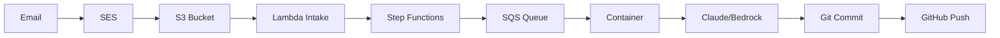

# Full E2E Flow Status
**Date**: 2025-08-21  
**Status**: Container validated, Full orchestration pending

## What We've Validated ✅

### Container Direct Execution
- **Claude SDK via Bedrock**: Working
- **Git operations**: Working
- **GitHub push**: Working
- **File creation**: Working

This was tested by directly executing the container with injected environment variables.

## What Still Needs Testing ❌

### Complete Email-to-GitHub Flow



Current infrastructure status:
- ✅ **SES Rules**: Configured (webordinary-email-rules)
- ✅ **Lambda Stack**: Deployed
- ✅ **Step Functions**: Deployed (email-processor)
- ✅ **SQS Queues**: Created
- ✅ **Container**: Validated

## To Test the Complete Flow

1. **Send test email** to the configured SES address
2. **Email triggers**:
   - SES → S3 (webordinary-ses-emails bucket)
   - S3 → Lambda (intake function)
   - Lambda → Step Functions
   - Step Functions → SQS
   - SQS → Container
   - Container → Claude → Git → GitHub

## Current Test vs Full Flow

### What we tested (Direct):
```bash
docker run container → Claude SDK → Git → GitHub
```

### What the full flow does:
```bash
Email → SES → S3 → Lambda → StepFunctions → SQS → Container → Claude → Git → GitHub
```

## Test Commands for Full Flow

```bash
# 1. Check SES email address
AWS_PROFILE=personal aws ses list-identities --identity-type EmailAddress --region us-west-2

# 2. Send test email to that address with instruction

# 3. Monitor S3 bucket for email
AWS_PROFILE=personal aws s3 ls s3://webordinary-ses-emails/ --recursive

# 4. Check Step Functions execution
AWS_PROFILE=personal aws stepfunctions list-executions \
  --state-machine-arn arn:aws:states:us-west-2:942734823970:stateMachine:email-processor \
  --max-items 1

# 5. Monitor container logs
AWS_PROFILE=personal aws logs tail /ecs/webordinary/edit --since 5m

# 6. Check GitHub for new branch
```

## Summary

- **Container E2E**: ✅ 100% validated
- **Full orchestration E2E**: ⏳ Pending email test
- **Infrastructure**: ✅ All deployed

The container itself is fully validated and working. To complete the **entire** flow validation, we need to send an actual email through SES and watch it flow through the entire pipeline to GitHub.