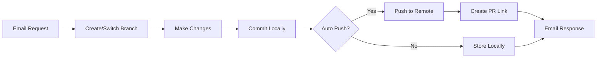

# Task 04: Enhanced Git Operations for Container

## Overview
Implement comprehensive git operations in the Claude Code Docker container to enable proper feature branch workflows, remote synchronization, and secure repository management. This builds upon the basic git functionality from Task 01 to create a production-ready git workflow.

## Business Requirements
- Enable Claude to work on feature branches independently
- Support fetching and merging changes from remote
- Maintain clean git history with meaningful commits
- Prevent accidental pushes to protected branches
- Support PR creation workflow integration

## Current State Analysis

### Existing Implementation (Task 01)
- **Basic Operations**: Clone, checkout, commit
- **Branch Creation**: Thread-based branches (`thread-{threadId}`)
- **Local Only**: No push/pull/fetch operations
- **Credentials**: Basic GitHub token setup

### Gaps to Address
1. **No Remote Sync**: Can't push changes or fetch updates
2. **No Branch Protection**: Could accidentally push to main
3. **No PR Integration**: Can't create pull requests
4. **Limited Conflict Resolution**: No merge/rebase strategies
5. **No Status Tracking**: Can't check remote branch status

## Target Architecture

### Git Workflow Design


### Branch Strategy
```
main (protected)
├── thread-abc123 (auto-push enabled)
├── thread-def456 (local only)
└── feature/user-requested-branch (manual)
```

## Technical Implementation

### 1. Enhanced ThreadManager

```typescript
// src/thread-manager.ts - Enhanced version
export class ThreadManager {
  private baseDir = '/workspace';
  private gitConfig: GitConfig;
  
  constructor(config?: GitConfig) {
    this.gitConfig = config || {
      autoPush: process.env.GIT_AUTO_PUSH === 'true',
      defaultBranch: process.env.GIT_DEFAULT_BRANCH || 'main',
      protectedBranches: (process.env.GIT_PROTECTED_BRANCHES || 'main,master,production').split(','),
      remoteName: process.env.GIT_REMOTE || 'origin',
    };
  }

  /**
   * Fetch latest changes from remote
   */
  async fetchRemote(projectPath: string): Promise<void> {
    console.log('Fetching latest from remote...');
    await execAsync(`cd ${projectPath} && git fetch --all --prune`);
  }

  /**
   * Pull changes from remote branch
   */
  async pullChanges(projectPath: string, branch: string): Promise<PullResult> {
    try {
      const result = await execAsync(
        `cd ${projectPath} && git pull ${this.gitConfig.remoteName} ${branch}`
      );
      return {
        success: true,
        message: result.stdout,
        hasConflicts: false,
      };
    } catch (error) {
      // Check for merge conflicts
      if (error.message.includes('conflict')) {
        return {
          success: false,
          message: 'Merge conflicts detected',
          hasConflicts: true,
          conflicts: await this.getConflictedFiles(projectPath),
        };
      }
      throw error;
    }
  }

  /**
   * Push changes to remote branch
   */
  async pushChanges(projectPath: string, branch: string, force = false): Promise<PushResult> {
    // Check if branch is protected
    if (this.gitConfig.protectedBranches.includes(branch) && !force) {
      throw new Error(`Cannot push to protected branch: ${branch}`);
    }

    const forceFlag = force ? '--force-with-lease' : '';
    
    try {
      // Set upstream if not exists
      await execAsync(
        `cd ${projectPath} && git push ${forceFlag} -u ${this.gitConfig.remoteName} ${branch}`
      );
      
      // Get the remote URL for PR creation
      const remoteUrl = await this.getRemoteUrl(projectPath);
      const prUrl = this.generatePRUrl(remoteUrl, branch);
      
      return {
        success: true,
        branch,
        prUrl,
        commits: await this.getUnpushedCommits(projectPath, branch),
      };
    } catch (error) {
      return {
        success: false,
        error: error.message,
        branch,
      };
    }
  }

  /**
   * Create a pull request (via GitHub CLI if available)
   */
  async createPullRequest(
    projectPath: string,
    branch: string,
    title: string,
    body: string
  ): Promise<PRResult> {
    // Check if gh CLI is available
    const hasGhCli = await this.commandExists('gh');
    
    if (hasGhCli) {
      try {
        const result = await execAsync(
          `cd ${projectPath} && gh pr create --base ${this.gitConfig.defaultBranch} --head ${branch} --title "${title}" --body "${body}"`
        );
        
        // Extract PR URL from output
        const prUrlMatch = result.stdout.match(/https:\/\/github\.com\/[\w-]+\/[\w-]+\/pull\/\d+/);
        
        return {
          success: true,
          prUrl: prUrlMatch ? prUrlMatch[0] : undefined,
          message: 'Pull request created successfully',
        };
      } catch (error) {
        // Fall back to generating URL
      }
    }
    
    // Generate PR URL for manual creation
    const remoteUrl = await this.getRemoteUrl(projectPath);
    const prUrl = this.generatePRUrl(remoteUrl, branch);
    
    return {
      success: false,
      prUrl,
      message: 'Please click the link to create PR manually',
    };
  }

  /**
   * Smart commit with automatic push based on configuration
   */
  async smartCommit(
    projectPath: string,
    message: string,
    threadId: string
  ): Promise<CommitResult> {
    const branch = await this.getCurrentBranch(projectPath);
    
    // Add all changes
    await execAsync(`cd ${projectPath} && git add -A`);
    
    // Check if there are changes to commit
    const status = await execAsync(`cd ${projectPath} && git status --porcelain`);
    if (!status.stdout.trim()) {
      return {
        success: false,
        message: 'No changes to commit',
      };
    }
    
    // Commit with thread ID in message
    const fullMessage = `${message}\n\nThread-ID: ${threadId}`;
    await execAsync(`cd ${projectPath} && git commit -m "${fullMessage}"`);
    
    // Get commit hash
    const commitHash = await execAsync(`cd ${projectPath} && git rev-parse HEAD`);
    
    // Auto-push if enabled and not on protected branch
    let pushResult;
    if (this.gitConfig.autoPush && !this.gitConfig.protectedBranches.includes(branch)) {
      pushResult = await this.pushChanges(projectPath, branch);
    }
    
    return {
      success: true,
      commitHash: commitHash.stdout.trim(),
      branch,
      pushed: pushResult?.success || false,
      prUrl: pushResult?.prUrl,
    };
  }

  /**
   * Check git status with remote comparison
   */
  async getEnhancedStatus(projectPath: string): Promise<GitStatus> {
    const branch = await this.getCurrentBranch(projectPath);
    
    // Fetch latest (don't pull, just update refs)
    await this.fetchRemote(projectPath);
    
    // Get local status
    const status = await execAsync(`cd ${projectPath} && git status --porcelain`);
    
    // Get ahead/behind counts
    const ahead = await execAsync(
      `cd ${projectPath} && git rev-list --count ${this.gitConfig.remoteName}/${branch}..HEAD`
    );
    const behind = await execAsync(
      `cd ${projectPath} && git rev-list --count HEAD..${this.gitConfig.remoteName}/${branch}`
    );
    
    // Get uncommitted changes
    const changes = this.parseGitStatus(status.stdout);
    
    return {
      branch,
      clean: !status.stdout.trim(),
      ahead: parseInt(ahead.stdout.trim()) || 0,
      behind: parseInt(behind.stdout.trim()) || 0,
      changes,
      canPush: !this.gitConfig.protectedBranches.includes(branch),
    };
  }

  /**
   * Merge or rebase from another branch
   */
  async integrateChanges(
    projectPath: string,
    fromBranch: string,
    strategy: 'merge' | 'rebase' = 'merge'
  ): Promise<IntegrationResult> {
    const currentBranch = await this.getCurrentBranch(projectPath);
    
    // Fetch latest
    await this.fetchRemote(projectPath);
    
    try {
      if (strategy === 'merge') {
        await execAsync(
          `cd ${projectPath} && git merge ${this.gitConfig.remoteName}/${fromBranch}`
        );
      } else {
        await execAsync(
          `cd ${projectPath} && git rebase ${this.gitConfig.remoteName}/${fromBranch}`
        );
      }
      
      return {
        success: true,
        strategy,
        fromBranch,
        toBranch: currentBranch,
      };
    } catch (error) {
      // Handle conflicts
      if (error.message.includes('conflict')) {
        return {
          success: false,
          strategy,
          fromBranch,
          toBranch: currentBranch,
          hasConflicts: true,
          conflicts: await this.getConflictedFiles(projectPath),
        };
      }
      throw error;
    }
  }

  // Helper methods
  private async getCurrentBranch(projectPath: string): Promise<string> {
    const result = await execAsync(`cd ${projectPath} && git branch --show-current`);
    return result.stdout.trim();
  }

  private async getRemoteUrl(projectPath: string): Promise<string> {
    const result = await execAsync(
      `cd ${projectPath} && git remote get-url ${this.gitConfig.remoteName}`
    );
    return result.stdout.trim();
  }

  private generatePRUrl(remoteUrl: string, branch: string): string {
    // Convert git URL to GitHub PR URL
    const match = remoteUrl.match(/github\.com[:/]([\w-]+)\/([\w-]+)/);
    if (match) {
      const [, owner, repo] = match;
      const cleanRepo = repo.replace('.git', '');
      return `https://github.com/${owner}/${cleanRepo}/compare/${this.gitConfig.defaultBranch}...${branch}?expand=1`;
    }
    return '';
  }

  private async getConflictedFiles(projectPath: string): Promise<string[]> {
    const result = await execAsync(
      `cd ${projectPath} && git diff --name-only --diff-filter=U`
    );
    return result.stdout.trim().split('\n').filter(Boolean);
  }

  private parseGitStatus(statusOutput: string): GitChanges {
    const lines = statusOutput.trim().split('\n').filter(Boolean);
    const changes = {
      added: [],
      modified: [],
      deleted: [],
      untracked: [],
    };
    
    for (const line of lines) {
      const [status, ...fileParts] = line.trim().split(' ');
      const file = fileParts.join(' ');
      
      if (status.includes('A')) changes.added.push(file);
      else if (status.includes('M')) changes.modified.push(file);
      else if (status.includes('D')) changes.deleted.push(file);
      else if (status === '??') changes.untracked.push(file);
    }
    
    return changes;
  }
}
```

### 2. API Endpoints for Git Operations

```typescript
// src/server.ts - Additional endpoints
app.post('/api/git/status', async (req, res) => {
  const { clientId, userId, threadId } = req.body;
  const workspace = await threadManager.getWorkspaceInfo(clientId, userId, threadId);
  const status = await threadManager.getEnhancedStatus(workspace.projectPath);
  res.json(status);
});

app.post('/api/git/push', async (req, res) => {
  const { clientId, userId, threadId, message } = req.body;
  const workspace = await threadManager.getWorkspaceInfo(clientId, userId, threadId);
  const result = await threadManager.smartCommit(workspace.projectPath, message, threadId);
  res.json(result);
});

app.post('/api/git/pull', async (req, res) => {
  const { clientId, userId, threadId, branch } = req.body;
  const workspace = await threadManager.getWorkspaceInfo(clientId, userId, threadId);
  const result = await threadManager.pullChanges(workspace.projectPath, branch || 'main');
  res.json(result);
});

app.post('/api/git/pr', async (req, res) => {
  const { clientId, userId, threadId, title, body } = req.body;
  const workspace = await threadManager.getWorkspaceInfo(clientId, userId, threadId);
  const branch = await threadManager.getCurrentBranch(workspace.projectPath);
  const result = await threadManager.createPullRequest(
    workspace.projectPath,
    branch,
    title,
    body
  );
  res.json(result);
});
```

### 3. Environment Configuration

```bash
# Git Configuration
GIT_AUTO_PUSH=true                                    # Auto-push after commits
GIT_DEFAULT_BRANCH=main                               # Default branch name
GIT_PROTECTED_BRANCHES=main,master,production         # Branches to protect
GIT_REMOTE=origin                                     # Remote name
GITHUB_TOKEN=ghp_xxxxxxxxxxxxx                        # GitHub personal access token

# Git User Configuration
GIT_USER_NAME="Claude Code Bot"
GIT_USER_EMAIL="claude@webordinary.com"

# PR Configuration
GH_CLI_ENABLED=true                                   # Enable GitHub CLI for PR creation
PR_AUTO_CREATE=false                                  # Auto-create PRs after push
PR_TEMPLATE_PATH=/templates/pr-template.md            # PR template location
```

### 4. Security Considerations

#### Branch Protection Rules
```typescript
const branchProtection = {
  // Never allow direct pushes to these branches
  absolute: ['main', 'master', 'production'],
  
  // Require approval for these patterns
  patterns: [
    /^release\/.*/,
    /^hotfix\/.*/,
  ],
  
  // Auto-delete after merge
  autoDelete: [
    /^thread-.*/,
    /^feature\/.*/,
  ],
};
```

#### Token Security
```typescript
// Secure token handling
class GitCredentialManager {
  private tokens: Map<string, string> = new Map();
  
  async getToken(clientId: string): Promise<string> {
    // Try client-specific token first
    const clientToken = process.env[`GITHUB_TOKEN_${clientId.toUpperCase()}`];
    if (clientToken) return clientToken;
    
    // Fall back to default token
    return process.env.GITHUB_TOKEN || '';
  }
  
  async validateToken(token: string): Promise<boolean> {
    try {
      const result = await fetch('https://api.github.com/user', {
        headers: { Authorization: `token ${token}` },
      });
      return result.ok;
    } catch {
      return false;
    }
  }
}
```

## Implementation Plan

### Phase 1: Core Git Operations (Day 1)
1. Implement fetch, pull, push methods
2. Add branch protection logic
3. Create status checking with remote comparison
4. Add conflict detection

### Phase 2: PR Workflow (Day 2)
1. Implement GitHub CLI integration
2. Add PR creation endpoint
3. Create PR templates
4. Add automated PR descriptions

### Phase 3: Security & Testing (Day 3)
1. Implement token validation
2. Add branch protection rules
3. Create comprehensive test suite
4. Document security best practices

## Acceptance Criteria

1. ✅ Can fetch latest changes from remote
2. ✅ Can push commits to feature branches
3. ✅ Protected branches cannot be pushed to directly
4. ✅ Can create pull requests (via CLI or URL)
5. ✅ Conflicts are detected and reported
6. ✅ Status shows ahead/behind counts
7. ✅ Auto-push configuration works
8. ✅ Thread branches are properly tracked
9. ✅ Tokens are securely managed
10. ✅ All git operations are logged

## Testing Plan

### Unit Tests
```typescript
describe('Git Operations', () => {
  it('should fetch from remote successfully');
  it('should prevent push to protected branches');
  it('should detect merge conflicts');
  it('should create PR with correct URL');
  it('should handle token validation');
});
```

### Integration Tests
1. Clone → Branch → Commit → Push → PR flow
2. Fetch → Pull → Merge conflict resolution
3. Multi-thread branch management
4. Token rotation and validation

### Security Tests
1. Attempt push to protected branch
2. Invalid token handling
3. Malicious branch name injection
4. Large file prevention

## Risk Mitigation

| Risk | Impact | Mitigation |
|------|--------|------------|
| Accidental push to main | High | Branch protection rules |
| Token exposure | Critical | Environment variables, validation |
| Merge conflicts | Medium | Conflict detection, manual resolution |
| Network failures | Low | Retry logic, graceful degradation |
| Large repos | Medium | Shallow clones, sparse checkout |

## Dependencies

- Task 01: Basic container with git
- Task 02: Fargate deployment (for GitHub CLI)
- GitHub personal access tokens
- Network access to GitHub

## Success Metrics

- **Push Success Rate**: > 95%
- **PR Creation Time**: < 5 seconds
- **Conflict Detection**: 100% accuracy
- **Token Validation**: < 100ms
- **Branch Protection**: 0 unauthorized pushes

## Future Enhancements

1. **GitLab/Bitbucket Support**: Extend beyond GitHub
2. **Automated Conflict Resolution**: AI-powered merge conflict resolution
3. **Branch Policies**: Custom rules per client
4. **Git Hooks**: Pre-commit, pre-push validations
5. **Audit Logging**: Complete git operation history