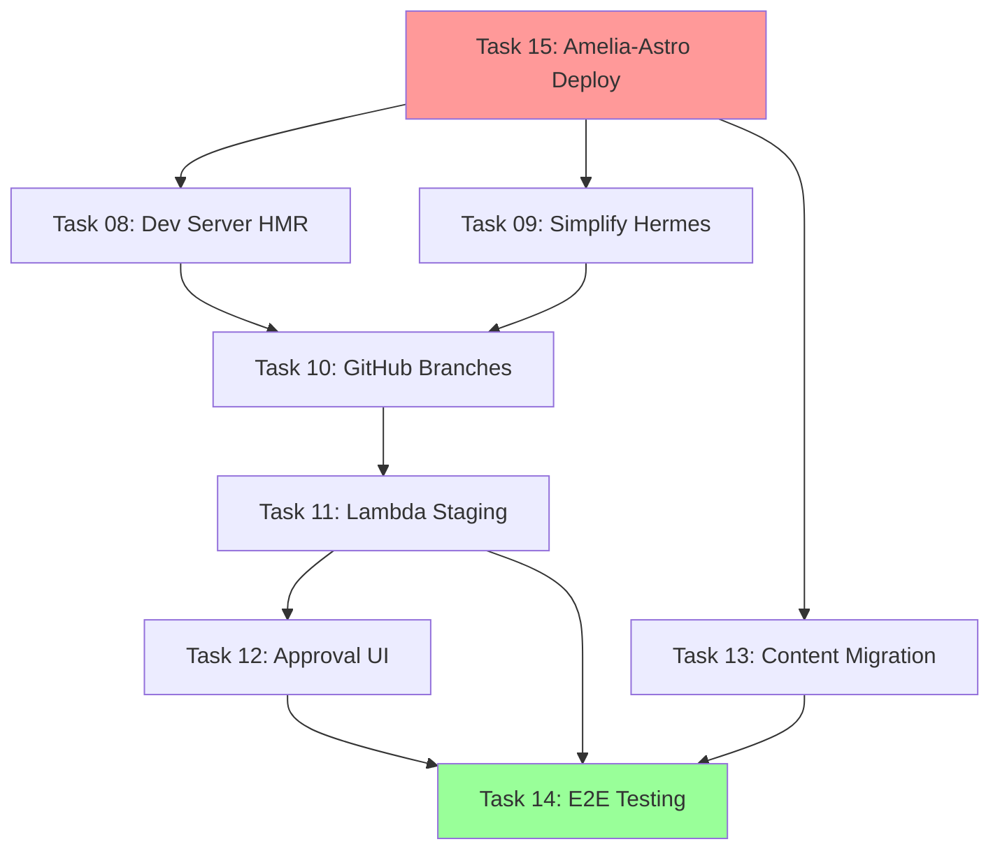

# Sprint 3 - Revised Task Order

## Critical Path Analysis

The original task order has dependency issues. We need a working Astro site deployed before we can test editor features, dev server, or content migration.

## Revised Execution Order

### Day 1-2: Foundation Setup
**Task 15: Amelia-Astro Dual Deployment** (was unplanned, now FIRST)
- Deploy amelia-astro to a test domain
- Set up template configuration system
- Create base editor environment
- **Why First**: Need a working site to test all editor features against

### Day 3-4: Editor Infrastructure  
**Task 08: Implement Astro Dev Server with HMR**
- Now we have amelia-astro to test HMR against
- Can verify WebSocket connections work
- Test live editing with real content

**Task 09: Simplify Hermes to Claude Code**
- Refactor with a real site to edit
- Test Claude Code against amelia-astro template

### Day 5-6: Version Control & Deployment
**Task 10: GitHub Branch Management**
- Test with actual amelia-astro changes
- Verify PR creation with real content

**Task 11: Lambda Build to Staging**
- Build and deploy amelia-astro variants
- Test staging/production separation

### Day 7-8: Safety & Content
**Task 12: Plan Approval UI**
- Test approval flow with real site changes
- Verify risky operations on amelia-astro

**Task 13: Content Migration**
- Migrate ameliastamps.com content INTO amelia-astro template structure
- Transform amelia-astro into ameliastamps variant

### Day 9-10: Testing & Launch
**Task 14: E2E Testing & Production Cutover**
- Full system test with real sites
- Production deployment

## Why This Order Makes More Sense

### Original Problems:
1. **No test site**: Tasks 08-12 assume we have a site to edit, but amelia-astro isn't deployed
2. **Content migration confusion**: Task 13 migrates ameliastamps content, but into what template?
3. **HMR testing impossible**: Can't test dev server without a working Astro site
4. **Claude Code has nothing to edit**: Simplifying Hermes (Task 09) needs a target site

### Revised Benefits:
1. **Day 1-2 gives us a working site** to test everything against
2. **Progressive enhancement**: Each task builds on a working foundation
3. **Real testing**: Every feature tested with actual content
4. **Clear migration path**: amelia-astro → ameliastamps variant

## Dependency Graph



## Quick Start Commands for Day 1

```bash
# Day 1: Get amelia-astro running immediately
cd amelia-astro
npm install
npm run dev  # Verify it works locally

# Deploy to test environment
SITE_MODE=template npm run build
aws s3 sync dist/ s3://webordinary-test-template/

# Create editor-compatible version
cp -r amelia-astro claude-code-container/workspace/template/
cd claude-code-container
docker build -t webordinary/claude-code-astro:template .
docker run -p 4321:4321 webordinary/claude-code-astro:template

# Now we have something to test Tasks 08-14 against!
```

## Recommended Approach

### Option A: Reorder Tasks (Recommended)
Execute in the revised order above. This ensures each task has what it needs to be properly tested.

### Option B: Parallel Tracks
- **Track 1** (Days 1-5): Tasks 15, 13 - Get sites ready
- **Track 2** (Days 1-5): Tasks 09, 10, 11 - Backend refactoring  
- **Convergence** (Days 6-8): Tasks 08, 12 - Integration features
- **Final** (Days 9-10): Task 14 - Testing & deployment

### Option C: Quick Mock Setup
If you want to stick with original order, create a minimal mock:
```bash
# Quick mock site for testing
mkdir test-site
cd test-site
npm create astro@latest -- --template minimal --yes
# Use this for Tasks 08-12 testing
# Then replace with real amelia-astro later
```

## Impact on Timeline

The revised order doesn't change the total timeline (still 10 days) but front-loads critical infrastructure:

| Days | Original Plan | Revised Plan | Benefit |
|------|--------------|--------------|---------|
| 1-2 | Dev Server HMR | Amelia-Astro Deploy | Have real site to work with |
| 3-4 | Simplify Hermes | Dev Server + Hermes | Test with actual content |
| 5-6 | GitHub + Lambda | GitHub + Lambda | Same, but with real site |
| 7-8 | Approval + Migration | Approval + Migration | Migration has clear target |
| 9-10 | E2E Testing | E2E Testing | More comprehensive testing |

## Recommendation

**Start with Task 15 immediately**. Even spending just 2-3 hours getting amelia-astro deployed to a test environment will make every subsequent task easier to implement and test. 

Without it, you'll be building features blind and will need significant rework once you have a real site to test against.