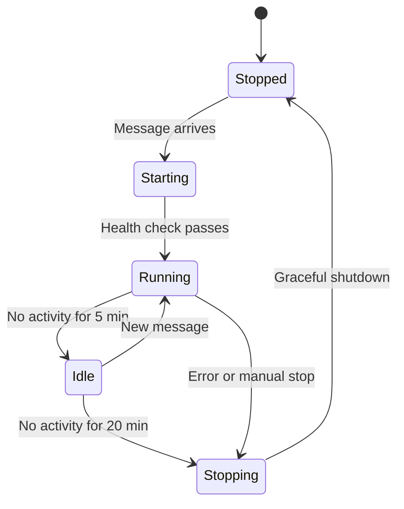

# Task 21: Session Resumption Logic (Wake Sleeping Containers)

## Objective
Implement logic to resume edit sessions by waking sleeping containers when new messages arrive for inactive sessions.

## Requirements

### Container States
1. **Running**: Container actively processing messages
2. **Idle**: Container running but no active sessions
3. **Stopped**: Container scaled to zero (cost savings)
4. **Starting**: Container being launched

### Resumption Triggers
- New message arrives for inactive session
- User accesses preview URL for stopped session
- Scheduled wake for maintenance

### Wake Process
1. Check container state in DynamoDB
2. If stopped, start Fargate task
3. Wait for container to be healthy
4. Route message to container queue
5. Update session status

## Implementation

### Hermes Session Resumption

```typescript
// hermes/src/modules/edit-session/services/session-resumption.service.ts
@Injectable()
export class SessionResumptionService {
  private readonly logger = new Logger(SessionResumptionService.name);
  
  constructor(
    private readonly ecsClient: ECSClient,
    private readonly dynamoClient: DynamoDBClient,
    private readonly containerManager: ContainerManagerService
  ) {}
  
  async resumeSession(
    sessionId: string,
    message: IncomingMessage
  ): Promise<SessionInfo> {
    this.logger.log(`Resuming session ${sessionId}`);
    
    // Get session info
    const session = await this.getSession(sessionId);
    if (!session) {
      throw new Error(`Session ${sessionId} not found`);
    }
    
    // Check container state
    const container = await this.getContainer(session.containerId);
    
    switch (container?.status) {
      case 'running':
        this.logger.log(`Container ${container.containerId} already running`);
        return session;
        
      case 'idle':
        this.logger.log(`Container ${container.containerId} is idle, sending wake signal`);
        await this.wakeIdleContainer(container);
        return session;
        
      case 'stopped':
      case undefined:
        this.logger.log(`Starting container for ${session.containerId}`);
        await this.startContainer(session);
        return session;
        
      case 'starting':
        this.logger.log(`Container ${container.containerId} is starting, waiting...`);
        await this.waitForContainer(container.containerId);
        return session;
        
      default:
        throw new Error(`Unknown container status: ${container.status}`);
    }
  }
  
  private async startContainer(session: SessionInfo): Promise<void> {
    const { clientId, projectId, userId } = this.parseContainerId(session.containerId);
    
    // Update container status to 'starting'
    await this.updateContainerStatus(session.containerId, 'starting');
    
    // Start Fargate task
    const taskArn = await this.containerManager.startContainer(
      clientId,
      projectId,
      userId
    );
    
    // Wait for container to be ready
    await this.waitForContainerHealth(taskArn);
    
    // Update container info
    const taskInfo = await this.getTaskInfo(taskArn);
    await this.dynamoClient.send(new UpdateItemCommand({
      TableName: 'webordinary-containers',
      Key: { containerId: { S: session.containerId } },
      UpdateExpression: `
        SET taskArn = :taskArn,
            containerIp = :ip,
            #status = :status,
            lastStarted = :now
      `,
      ExpressionAttributeNames: {
        '#status': 'status'
      },
      ExpressionAttributeValues: {
        ':taskArn': { S: taskArn },
        ':ip': { S: taskInfo.privateIp },
        ':status': { S: 'running' },
        ':now': { N: Date.now().toString() }
      }
    }));
    
    this.logger.log(`Container ${session.containerId} started successfully`);
  }
  
  private async wakeIdleContainer(container: ContainerInfo): Promise<void> {
    // Send a wake message to the container's management queue
    const wakeMessage = {
      type: 'wake',
      timestamp: Date.now(),
      reason: 'session_resumed'
    };
    
    await this.sqsClient.send(new SendMessageCommand({
      QueueUrl: container.managementQueueUrl,
      MessageBody: JSON.stringify(wakeMessage)
    }));
    
    // Update last activity
    await this.updateContainerActivity(container.containerId);
  }
  
  private async waitForContainer(
    containerId: string,
    timeout: number = 60000
  ): Promise<void> {
    const startTime = Date.now();
    
    while (Date.now() - startTime < timeout) {
      const container = await this.getContainer(containerId);
      
      if (container?.status === 'running') {
        this.logger.log(`Container ${containerId} is now running`);
        return;
      }
      
      await new Promise(resolve => setTimeout(resolve, 5000));
    }
    
    throw new Error(`Container ${containerId} failed to start within ${timeout}ms`);
  }
  
  private async waitForContainerHealth(
    taskArn: string,
    timeout: number = 120000
  ): Promise<void> {
    const startTime = Date.now();
    
    while (Date.now() - startTime < timeout) {
      const task = await this.ecsClient.send(new DescribeTasksCommand({
        cluster: 'webordinary-edit-cluster',
        tasks: [taskArn]
      }));
      
      const taskStatus = task.tasks?.[0];
      if (!taskStatus) {
        throw new Error(`Task ${taskArn} not found`);
      }
      
      // Check if task is running and healthy
      if (taskStatus.lastStatus === 'RUNNING') {
        const healthStatus = taskStatus.healthStatus;
        if (healthStatus === 'HEALTHY' || !healthStatus) {
          // No health check or healthy
          this.logger.log(`Task ${taskArn} is healthy`);
          return;
        }
      } else if (taskStatus.lastStatus === 'STOPPED') {
        throw new Error(`Task ${taskArn} stopped unexpectedly: ${taskStatus.stoppedReason}`);
      }
      
      await new Promise(resolve => setTimeout(resolve, 5000));
    }
    
    throw new Error(`Task ${taskArn} failed to become healthy within ${timeout}ms`);
  }
}
```

### Container Auto-Sleep Logic

```typescript
// claude-code-container/src/auto-sleep.ts
export class AutoSleepManager {
  private lastActivity: number = Date.now();
  private idleCheckInterval: NodeJS.Timer;
  private readonly IDLE_TIMEOUT = 20 * 60 * 1000; // 20 minutes
  
  constructor(
    private containerId: string,
    private dynamodb: DynamoDBClient
  ) {}
  
  start() {
    // Check for idle state every minute
    this.idleCheckInterval = setInterval(() => {
      this.checkIdleState();
    }, 60000);
  }
  
  recordActivity() {
    this.lastActivity = Date.now();
    this.updateContainerActivity();
  }
  
  private async checkIdleState() {
    const idleTime = Date.now() - this.lastActivity;
    
    if (idleTime > this.IDLE_TIMEOUT) {
      console.log(`Container idle for ${idleTime}ms, checking sessions...`);
      
      // Check if any sessions are active
      const activeSessions = await this.getActiveSessions();
      
      if (activeSessions === 0) {
        console.log('No active sessions, initiating shutdown...');
        await this.initiateShutdown();
      } else {
        console.log(`${activeSessions} active sessions, staying alive`);
      }
    }
  }
  
  private async getActiveSessions(): Promise<number> {
    const result = await this.dynamodb.send(new QueryCommand({
      TableName: 'webordinary-edit-sessions',
      IndexName: 'container-index',
      KeyConditionExpression: 'containerId = :cid',
      ExpressionAttributeValues: {
        ':cid': { S: this.containerId }
      },
      Select: 'COUNT'
    }));
    
    return result.Count || 0;
  }
  
  private async initiateShutdown() {
    // Update container status
    await this.dynamodb.send(new UpdateItemCommand({
      TableName: 'webordinary-containers',
      Key: { containerId: { S: this.containerId } },
      UpdateExpression: 'SET #status = :status, stoppedAt = :now',
      ExpressionAttributeNames: {
        '#status': 'status'
      },
      ExpressionAttributeValues: {
        ':status': { S: 'stopping' },
        ':now': { N: Date.now().toString() }
      }
    }));
    
    // Save any uncommitted work
    await this.saveWork();
    
    // Exit process (ECS will handle task stoppage)
    process.exit(0);
  }
  
  private async updateContainerActivity() {
    await this.dynamodb.send(new UpdateItemCommand({
      TableName: 'webordinary-containers',
      Key: { containerId: { S: this.containerId } },
      UpdateExpression: 'SET lastActivity = :now',
      ExpressionAttributeValues: {
        ':now': { N: Date.now().toString() }
      }
    }));
  }
  
  private async saveWork() {
    // Commit any uncommitted changes
    const git = simpleGit(process.env.WORKSPACE_PATH);
    const status = await git.status();
    
    if (status.files.length > 0) {
      await git.add('./*');
      await git.commit('Auto-save: Container sleeping');
      await git.push();
      console.log('Uncommitted work saved');
    }
  }
  
  stop() {
    clearInterval(this.idleCheckInterval);
  }
}
```

### Preview URL Wake Handler

```typescript
// hephaestus/lambdas/preview-wake/index.ts
export const handler = async (event: ALBEvent): Promise<ALBResult> => {
  const path = event.path;
  const match = path.match(/^\/session\/([^\/]+)/);
  
  if (!match) {
    return { statusCode: 404, body: 'Invalid session URL' };
  }
  
  const chatThreadId = match[1];
  const clientId = extractClientFromHost(event.headers.host);
  const sessionId = `${clientId}-${chatThreadId}`;
  
  // Check session status
  const session = await getSession(sessionId);
  
  if (!session) {
    return {
      statusCode: 404,
      body: 'Session not found'
    };
  }
  
  // Check container status
  const container = await getContainer(session.containerId);
  
  if (container?.status === 'stopped' || !container) {
    // Start container
    await startContainer(session.containerId);
    
    // Return waiting page with auto-refresh
    return {
      statusCode: 202,
      headers: {
        'Content-Type': 'text/html',
        'Refresh': '5'
      },
      body: `
        <html>
          <head>
            <meta http-equiv="refresh" content="5">
            <title>Starting Edit Session...</title>
          </head>
          <body>
            <h1>Starting Edit Session</h1>
            <p>Your edit environment is starting up...</p>
            <p>This page will automatically refresh in 5 seconds.</p>
            <div class="spinner"></div>
          </body>
        </html>
      `
    };
  }
  
  // Container is running, proxy the request
  return proxyToContainer(event, container.containerIp);
};
```

## State Transitions



## Success Criteria
- [ ] Containers wake on new messages
- [ ] Preview URLs trigger container start
- [ ] Idle containers sleep after timeout
- [ ] State transitions tracked in DynamoDB
- [ ] Work saved before shutdown
- [ ] Graceful handling of wake failures

## Testing
- Test container wake from stopped state
- Verify idle timeout works correctly
- Test preview URL wake functionality
- Verify work preservation on sleep
- Test concurrent wake requests
- Monitor wake time metrics