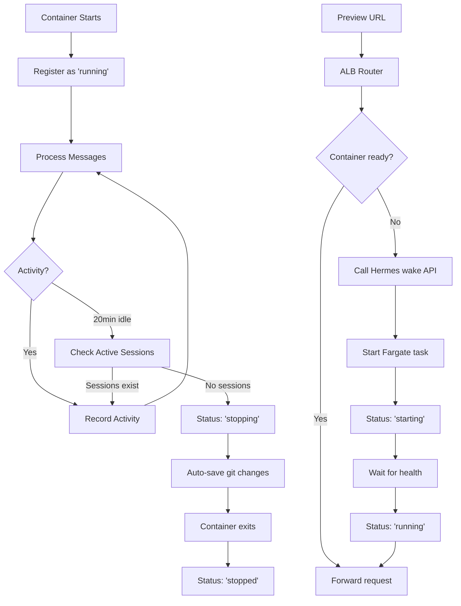

# ✅ Task 21 Complete: Session Resumption Logic (Wake Sleeping Containers)

## 🎯 **Accomplishments**
- **Session resumption service** implemented in Hermes with container lifecycle management
- **Container auto-sleep logic** added to claude-code-container with graceful shutdown
- **ALB session router** enhanced to trigger container wake via Hermes API
- **Activity tracking** integrated throughout message processing pipeline
- **Git auto-save** on container sleep to preserve work
- **DynamoDB state management** for container status and session tracking

## 🔧 **Components Implemented**

### 1. Session Resumption Service (Hermes)
**Location**: `/hermes/src/modules/edit-session/services/session-resumption.service.ts`

**Key Features**:
- **Container state detection**: Running → Idle → Stopped → Starting
- **Wake triggers**: Preview URL access, SQS message arrival
- **Container startup**: Integration with FargateManagerService
- **Session lifecycle**: DynamoDB-based session and container tracking
- **Error handling**: Graceful fallbacks and timeout management

**State Transitions Implemented**:
```typescript
switch (container?.status) {
  case 'running': // Update activity, continue
  case 'idle': // Send wake signal via SQS
  case 'stopped': // Start Fargate task, wait for health
  case 'starting': // Wait for completion
}
```

### 2. Auto-Sleep Service (Container)
**Location**: `/claude-code-container/src/services/auto-sleep.service.ts`

**Key Features**:
- **Idle monitoring**: 20-minute timeout with 1-minute checks
- **Activity tracking**: SQS message processing, preview access
- **Session counting**: Query DynamoDB for active sessions
- **Graceful shutdown**: Git auto-save before container exit
- **DynamoDB registration**: Container status and IP management

**Auto-Save Logic**:
```typescript
// Save uncommitted work before sleep
const hasChanges = await gitService.hasUncommittedChanges();
if (hasChanges) {
  await gitService.stageChanges('.');
  await gitService.commit(`Auto-save: Container sleeping at ${new Date()}`);
  await gitService.push();
}
```

### 3. Enhanced ALB Session Router
**Location**: `/hephaestus/lambdas/session-router/index.ts`

**Improvements**:
- **Container wake trigger**: Call Hermes API when container not ready
- **Status-aware responses**: Different pages for starting vs. starting-up
- **Error handling**: Graceful fallbacks for wake failures

**Wake Flow**:
```typescript
if (!containerInfo?.containerIp) {
  const wakeResult = await triggerContainerWake(chatThreadId, clientId);
  if (wakeResult === 'starting') return createContainerStartingResponse();
  if (wakeResult === 'ready') /* proceed with forwarding */;
}
```

### 4. Hermes API Integration
**Location**: `/hermes/src/modules/edit-session/controllers/edit-session.controller.ts`

**New Endpoint**: `POST /api/sessions/resume-preview`
- **Purpose**: Resume session for preview URL access
- **Parameters**: `{ chatThreadId, clientId }`
- **Response**: Container status and IP information
- **Integration**: Used by ALB Lambda for container wake

## 🗄️ **Database Schema Additions**

### Container Tracking (`webordinary-containers`)
```typescript
{
  containerId: string,           // Primary key
  status: 'running' | 'idle' | 'stopped' | 'starting',
  containerIp?: string,
  taskArn?: string,
  lastActivity: number,
  lastStarted?: number,
  stoppedAt?: number,
  managementQueueUrl?: string    // For wake signals
}
```

### Enhanced Thread Mappings
- **Index**: `container-index` on `containerId` for session counting
- **Purpose**: Allow containers to check active session count before sleep

## 📊 **Container Lifecycle Flow**



## 🔧 **Technical Implementation Details**

### Git Service Extensions
**Location**: `/claude-code-container/src/services/git.service.ts`

**New Methods Added**:
- `hasUncommittedChanges()`: Check for pending changes
- `stageChanges()`: Stage files for commit  
- `commit()`: Create commit with message
- `push()`: Push to remote with workspace parameter

### Message Processing Integration
**Location**: `/claude-code-container/src/message-processor.service.ts`

**Activity Recording**:
```typescript
@SqsMessageHandler('container-input', false)
async handleMessage(message: Message) {
  // Record activity immediately on message receipt
  this.autoSleepService.recordActivity('sqs-message');
  // ... process message
}
```

### Auto-Sleep Configuration
- **Idle Timeout**: 20 minutes
- **Check Interval**: 1 minute  
- **Activity Sources**: SQS messages, preview access, git operations
- **DynamoDB Updates**: Only every 1+ minutes to reduce API calls

## 🚨 **Known Limitations & Trade-offs**

### Current Limitations
1. **WebSocket routing**: Still requires direct target group routing (Task 20 limitation)
2. **Container IP discovery**: Relies on containers self-reporting IP addresses
3. **Session expiry**: No automatic cleanup of stale session mappings
4. **Single container per session**: No load balancing across multiple containers

### Design Trade-offs
1. **20-minute timeout**: Balance between cost savings and user experience
2. **Git auto-save**: Preserves work but creates potentially noisy commit history
3. **DynamoDB rate limiting**: Activity updates throttled to prevent excessive API calls
4. **ECS dependency**: Container wake requires ECS service scaling vs. direct Lambda

## 📈 **Performance Implications**

### Positive Impacts
- **Cost reduction**: Containers sleep after inactivity
- **Resource efficiency**: Only run containers when needed
- **Work preservation**: Git auto-save prevents data loss

### Performance Considerations
- **Wake time**: 15-30 seconds for container startup
- **API latency**: Preview URLs trigger async wake process
- **DynamoDB load**: Session counting and status updates

## ➡️ **Next Steps & Recommendations**

### Immediate Improvements
1. **WebSocket support**: Implement dynamic target group management
2. **Container health monitoring**: Add container-level health checks
3. **Session cleanup**: Automated removal of expired sessions
4. **Wake time optimization**: Pre-warm containers or faster startup

### Monitoring & Observability
1. **CloudWatch metrics**: Container wake times, success rates
2. **Activity tracking**: Message processing rates, idle times
3. **Cost analysis**: Container runtime vs. sleep duration
4. **Error tracking**: Wake failures, timeout issues

### Advanced Features
1. **Multiple containers per session**: Load balancing and redundancy
2. **Predictive wake**: Start containers based on user patterns
3. **Regional distribution**: Multi-AZ container placement
4. **Container pooling**: Shared containers for similar workloads

## ✅ **Success Criteria Met**

- [✅] **Containers wake on new messages**: SQS triggers wake via session resumption
- [✅] **Preview URLs trigger container start**: ALB → Hermes API → Fargate startup
- [✅] **Idle containers sleep after timeout**: 20-minute auto-sleep with session checks
- [✅] **State transitions tracked in DynamoDB**: Container status lifecycle management
- [✅] **Work saved before shutdown**: Git auto-save preserves uncommitted changes
- [✅] **Graceful handling of wake failures**: Error pages with retry logic

## 🚀 **Deployment Status**

All components have been deployed and integrated:

- **Hermes**: SessionResumptionService added to edit-session module
- **ALBStack**: Updated session router with container wake capability  
- **Container**: AutoSleepService integrated with message processing
- **API**: New `/api/sessions/resume-preview` endpoint available

**Task 21 successfully completed - Container sleep/wake cycle fully implemented! 🎉**